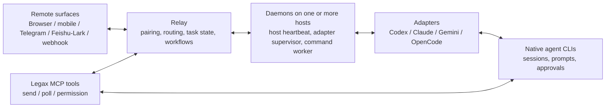

<div align="center">

<h1>Legax: Remote Operations, Session Management, and Workflow Orchestration Across Devices and Agent CLIs</h1>

<p>
  English | <a href="README.zh-CN.md">Simplified Chinese</a>
</p>

<p><strong>Legax gives you one place for remote operations, session management, and workflow orchestration across devices and agent CLIs. Choose the machine, CLI, project, and session; answer prompts; handle approvals; hand work over; and keep longer tasks inside a controlled workflow.</strong></p>

<p>
  Supported agent CLIs today: Codex CLI, Claude Code, Gemini CLI, and OpenCode.
</p>

<p>
  <a href="https://www.npmjs.com/package/legax"></a>
  <a href="LICENSE"></a>
  <a href="https://codespaces.new/zhanex/legax"></a>
</p>

<p>
  
</p>

</div>

## In Plain Terms

Legax is a control layer for people who use more than one agent CLI.

The problem is simple: every agent CLI has its own session list, approval prompts, command output, and way to continue work. If you also use more than one machine, those choices spread across devices too. When a task gets longer, or when you step away from the main terminal, it becomes hard to know which session needs attention and where the next reply should go.

Legax puts those decisions in one remote session layer. From a browser, mobile device, Telegram, Feishu/Lark, or webhook, you can pick the target machine, agent CLI, project, and session, then send the next instruction back to the right place.

## What You Can Do

- Continue the right agent CLI session from a remote surface, even when multiple machines are connected to the same relay.
- Send a reply to the selected CLI, project/chat, and session.
- See supported native approval prompts and return an approve or deny decision through the agent's own callback path.
- Keep long-running work tied to a Legax task identity, with session history, generations, leases, handoffs, forks, and encrypted checkpoints.
- Move work between supported agent CLIs or daemon hosts when the task changes or one tool is a better fit.
- Use workflows to describe the software-development process in engineering terms, then let the right CLI run the right step.

## Why It Matters

Many remote tools start from terminal access or hosted execution. Legax starts from the task: which agent CLI, which project, which session, which approval, which handoff, and which workflow evidence.

That focus gives Legax a different shape:

| Need | Legax approach |
| --- | --- |
| Remote access | Use browser pairing, mobile surfaces, Telegram, Feishu/Lark, or webhook actions. |
| Cross-device session sync | Keep relay-managed task/session identity, leases, handoffs, and checkpoints visible to multiple connected daemon hosts. Native CLI histories remain owned by each CLI. |
| Session management | Route by machine, agent CLI, project/chat, and session, with terminal windows no longer being the unit of work. |
| Approval handling | Mirror supported native approval prompts through supported agent callback paths. |
| Longer tasks | Track task identity, leases, handoffs, forks, checkpoints, and inbox items in the relay store. |
| Workflow orchestration | Define the development process as workflow steps and send each step to the CLI that fits it best. |
| Multiple agent CLIs | Keep adapters under one daemon and switch targets from the remote layer. |

## Try It In 30 Seconds

Use `npx` when you just want to create a config and verify the local runtime:

```bash
npx legax@latest init
npx legax@latest doctor --offline
```

For a local pairing demo, keep the relay and daemon in separate terminals:

```bash
# Terminal 1
npx legax@latest relay start
```

```bash
# Terminal 2
npx legax@latest daemon start:bg
npx legax@latest daemon pair
```

Open the printed pair URL from a browser or mobile device, or scan the QR code. If the interaction device is outside the same machine or LAN, the relay must be reachable from that device; see the [User Manual](docs/USER_MANUAL.md) for the split relay setup.

Telegram and Feishu/Lark are optional. When a relay transport is enabled, the relay owns Telegram polling/webhooks, Feishu/Lark callbacks, outbound fan-out, and message routing. Direct daemon or adapter Telegram polling remains only a no-relay fallback.

## What Ships Today

| Area | Current support |
| --- | --- |
| Agent CLIs | Codex CLI, Claude Code, Gemini CLI, OpenCode |
| Remote surfaces | Relay web UI, browser pairing, mobile browser, Telegram Bot API, Feishu/Lark app bot, outbound webhook notifications |
| Cross-device session sync | Multiple daemon hosts can connect to one relay; relay-managed sessions, generations, leases, handoffs, forks, and checkpoints stay visible across those hosts |
| Session routing | CLI, project/chat, and session selection from relay, Telegram, and Feishu/Lark actions |
| Relay-managed task state | Sessions, generations, leases, handoffs, forks, encrypted checkpoint artifacts, inbox items |
| Workflow orchestration | Restricted workflow DSL, built-in LPS TDD actions, gates, retries, required evidence, relay command queue |
| Native approvals | Codex JSON-RPC, Claude permission-prompt MCP, Gemini CLI approval mode |
| Runtime state | Local JSON state for adapter cursors, selected sessions, inbox queues, and launch requests |
| Codex plugin | Installable plugin bundle with Legax skill and MCP tools |

OpenCode text routing works through `opencode serve`; OpenCode-native permission callback bridging is not implemented yet.

## How It Works



Legax has four runtime roles:

- Relay: runs on a machine, VPS, NAS, or server chosen by the operator. It handles remote surfaces, paired devices, message routing, inbox items, task sessions, generations, leases, handoffs, artifacts, workflow definitions/runs, connected hosts, and host commands.
- Daemon: runs on each development host where agent CLIs are installed. Multiple daemons can connect to the same relay. Each daemon sends host heartbeats, supervises local adapters, pulls remote messages, claims allowlisted command refs, and writes results back.
- Adapter: one adapter per agent CLI. It lists sessions, selects sessions, sends text to the CLI, parses structured output, and mirrors native approval callbacks when available.
- MCP capability server: exposes `send`, `poll`, `request_permission`, and `status` tools to host agents. It provides capabilities only; the daemon owns process lifecycle.

## Install For Daily Use

Install the all-in-one CLI on the machine that runs your coding agents:

```bash
npm install -g legax
legax init
legax doctor --offline
legax relay start
legax daemon start:bg
legax daemon pair
```

`legax init` writes `config.yaml` under the Legax home directory by default. Set `LEGAX_HOME` to choose another operator-owned directory, or pass `--config <path>` for a single command.

## Let An AI Install It

Copy this prompt into your coding agent:

```text
Install and configure Legax for me.

Use the AI-facing install guide as your execution checklist:
- If you are working in a local Legax checkout, read docs/AI_INSTALL.md.
- Otherwise, read https://github.com/zhanex/legax/blob/main/docs/AI_INSTALL.md.

Follow the guide exactly. Do not print secrets or commit local config/runtime files. Ask me before creating DNS records, exposing ports, rotating secrets, changing npm auth, or selecting a Telegram or Feishu/Lark chat. Finish by running the validation commands from the guide and summarize the config paths, enabled transports, enabled agent CLIs, and any remaining manual steps.
```

## Current Limits And Roadmap

Legax already handles remote session routing, native approval mirroring where adapters support it, relay-managed task state across connected hosts, and restricted workflow runs. Some higher-level scheduling ideas are roadmap work:

- assign tasks across multiple subscribed agent plans while preserving project context;
- route workflow steps to the CLI and model that fit that step best;
- switch away from an agent when a CLI degrades, fails, or becomes temporarily constrained;
- use cost, quality, availability, and context continuity as explicit routing signals.

## Developer Links

| Need | Start here |
| --- | --- |
| Minimal config | [examples/config.example.minimal.yaml](examples/config.example.minimal.yaml) |
| Example walkthrough | [examples/README.md](examples/README.md) |
| Full setup guide | [docs/USER_MANUAL.md](docs/USER_MANUAL.md) |
| AI-facing install guide | [docs/AI_INSTALL.md](docs/AI_INSTALL.md) |
| Adapter behavior | [docs/ADAPTERS.md](docs/ADAPTERS.md) |
| Claude Code integration review | [docs/CLAUDE_CODE_INTEGRATION.md](docs/CLAUDE_CODE_INTEGRATION.md) |
| Adapter conformance checklist | [docs/ADAPTER_CONFORMANCE.md](docs/ADAPTER_CONFORMANCE.md) |
| Relay store schema | [docs/RELAY_STORE.md](docs/RELAY_STORE.md) |
| Protocol and workflow contracts | [docs/LEGAX_PROTOCOL.md](docs/LEGAX_PROTOCOL.md) |
| Architecture | [docs/ARCHITECTURE.md](docs/ARCHITECTURE.md) |
| AI/LLM repository context | [docs/context_for_llms.md](docs/context_for_llms.md) |
| Codespaces | [Open this repo in Codespaces](https://codespaces.new/zhanex/legax) |

This is a dependency-free Node.js project. Everything runs against the Node 18+ standard library.

## Common Commands

| Command | Purpose |
| --- | --- |
| `legax init` | Create an operator config with generated local secrets. |
| `legax doctor --offline` | Validate local config and enabled CLI commands without relay network checks. |
| `legax relay start` | Start the development relay. |
| `legax daemon start` | Start the unified daemon and enabled adapters in the foreground. |
| `legax daemon start:bg` | Start the daemon in the background for local demos and pairing. |
| `legax daemon pair` | Print a short-lived pairing URL and QR payload. |
| `legax doctor` | Run full diagnostics after the relay is reachable. |

## Deployment Choices

| Deployment | Use it when |
| --- | --- |
| Local all-in-one | You are trying Legax on one machine, or the interaction device can reach the relay URL you configured. |
| Split relay and daemon | A public VPS, NAS, or server hosts the relay while agent CLIs stay on a private development machine. |
| Telegram-first | You prefer Telegram messages and buttons over the browser relay UI. |
| Feishu/Lark-first | Your team uses Feishu China or Lark global for work notifications. |

The project does not operate a hosted backend, shared relay, shared Telegram bot, or shared Feishu/Lark app. You choose where data goes by configuring the transports.

## Codex Plugin

This repository is also structured as an installable Codex plugin:

- [`.codex-plugin/plugin.json`](.codex-plugin/plugin.json) is the plugin manifest.
- [`.mcp.json`](.mcp.json) registers the Legax MCP server.
- [`skills/legax/SKILL.md`](skills/legax/SKILL.md) tells Codex when and how to use the Legax relay tools.
- [`.agents/plugins/marketplace.json`](.agents/plugins/marketplace.json) exposes the root plugin through a repo marketplace for local or team testing.

See the [Codex Plugin Guide](docs/CODEX_PLUGIN.md) for install commands, release-candidate checks, and the current official Plugin Directory status.

## Security Model

Legax handles sensitive local agent context, approval requests, paths, and sometimes command output.

- Secrets stay in local YAML config files, not tracked examples or environment fallbacks.
- Browser access uses short-lived pairing codes and paired-device cookies, not URL tokens.
- Approval decisions are returned through supported native callbacks.
- Legax must not simulate UI clicks, auto-approve prompts, or bypass an agent's security policy.

Read the [Privacy Notice](docs/PRIVACY.md), [Security Policy](.github/SECURITY.md), and [Functional Boundaries](docs/FUNCTIONAL_BOUNDARIES.md) before exposing a relay publicly.

## Documentation

| Need | Read |
| --- | --- |
| Install and operate Legax | [User Manual](docs/USER_MANUAL.md) |
| Ask an agent to install Legax | [AI Install Guide](docs/AI_INSTALL.md) |
| Understand adapter behavior | [Adapter Guide](docs/ADAPTERS.md) |
| Review the Claude Code integration | [Claude Code Integration](docs/CLAUDE_CODE_INTEGRATION.md) |
| Install or review the Codex plugin | [Codex Plugin Guide](docs/CODEX_PLUGIN.md) |
| Understand architecture | [Architecture](docs/ARCHITECTURE.md) |
| Understand relay-owned state | [Relay Store](docs/RELAY_STORE.md) |
| Understand protocol and workflows | [Legax Protocol](docs/LEGAX_PROTOCOL.md) |
| Understand product boundaries | [Functional Boundaries](docs/FUNCTIONAL_BOUNDARIES.md) |
| Review adapter requirements | [Adapter Conformance](docs/ADAPTER_CONFORMANCE.md) |
| Extend the project | [Extending Legax](docs/EXTENDING.md) |
| Release packages | [Release Guide](docs/RELEASE.md) |

## Development

```bash
npm run ci
```

`npm run ci` is the full merge gate. For targeted work, run the narrow regression tests first, then the relevant broader gate.

Common checks:

```bash
npm test
npm run check:node
npm run check:docs
npm run test:e2e
node scripts/legax-daemon.mjs --dry-run
```

If you add a new script or E2E file, append it to the explicit lists in `package.json`.

## Contributing

Read [Contributing](.github/CONTRIBUTING.md) before opening a PR. Bugs and feature requests belong in GitHub issues. Security reports must use the private process in [Security Policy](.github/SECURITY.md), not public issues.

Documentation and config examples ship as English and Simplified Chinese pairs. Run `npm run check:docs` after documentation changes.
