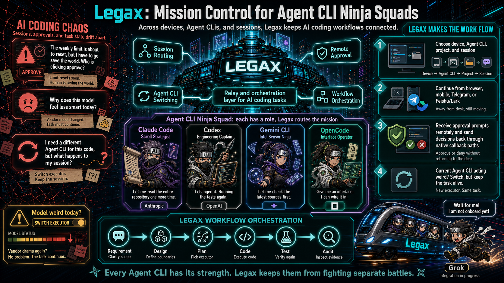
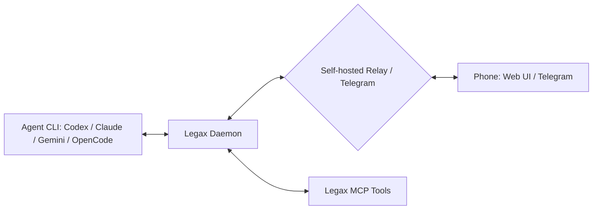

<div align="center">

<h1>Legax: Universal Remote Control & Relay for AI Coding Agents</h1>

<p>
  English | <a href="README.zh-CN.md">Simplified Chinese</a>
</p>

<p><strong>Control Codex, Claude Code, Gemini CLI, and OpenCode from your phone or any device.</strong></p>

<p>
  Legax is a local-first remote control layer for AI coding agents. It forwards important agent events to your phone, routes replies back to the selected CLI/project/session, and returns supported approval decisions through each agent's native callback path.
</p>

<p>
  <a href="https://www.npmjs.com/package/legax"></a>
  <a href="LICENSE"></a>
  <a href="https://codespaces.new/zhanex/legax"></a>
</p>

<p>
  
</p>

</div>

## Try It In 30 Seconds

Use `npx` when you just want to create a config and verify the local runtime:

```bash
npx legax@latest init
npx legax@latest doctor --offline
```

For a local phone pairing demo, keep the relay and daemon in separate terminals:

```bash
# Terminal 1
npx legax@latest relay start
```

```bash
# Terminal 2
npx legax@latest daemon start:bg
npx legax@latest daemon pair
```

Open the printed pair URL from your phone, or scan the QR code. For a real phone outside the same machine or LAN, the relay must be reachable from the phone; see the [User Manual](docs/USER_MANUAL.md) for the split relay setup.

## Why Developers Want It

Coding agents often need attention after you leave the desk: a permission prompt, a clarification, a finished run, or a session you want to continue from another room. Legax keeps that loop on infrastructure you control.

| Problem | Legax path |
| --- | --- |
| You miss approval prompts while away from the computer. | Forward supported native approvals to your phone and return the decision through the agent callback. |
| You need to continue a local session remotely. | Route phone replies to the selected CLI, project, and session. |
| You want phone access without exposing terminal control. | Use relay pairing, Telegram buttons, and adapter APIs instead of UI scraping. |
| Your team uses multiple agent CLIs. | Run Codex, Claude Code, Gemini CLI, and OpenCode adapters under one daemon. |

## Feature Matrix

| Feature | Codex CLI | Claude Code CLI | Gemini CLI | Legax |
| --- | --- | --- | --- | --- |
| Phone or browser remote control | Limited to native surfaces | No general phone relay | No general phone relay | Web UI, Telegram, webhook |
| Multi-agent routing | No | No | No | Codex, Claude Code, Gemini CLI, OpenCode |
| Self-hosted relay | No | No | No | Yes |
| Cross-device session selection | No | No | No | CLI, project/chat, and session menus |
| Native approval mirroring | Codex only | Claude only | Gemini only | Supported native paths across adapters |
| MCP tools for agent workflows | Host-specific | Host-specific | Host-specific | Generic Legax MCP server |

OpenCode text routing works through `opencode serve`; OpenCode-native permission callback bridging is not implemented yet.

## How It Works



The daemon owns process supervision, inbound routing, session selection, and on-demand launches. Adapters own each CLI's lifecycle and session model. MCP tools are capabilities for agents, not lifecycle managers.

## Install For Daily Use

Install the all-in-one CLI on the machine that runs your coding agents:

```bash
npm install -g legax
legax init
legax doctor --offline
legax relay start
legax daemon start:bg
legax daemon pair
```

`legax init` writes `config.yaml` under the Legax home directory by default. Set `LEGAX_HOME` to choose another operator-owned directory, or pass `--config <path>` for a single command.

## Let An AI Install It

Copy this prompt into your coding agent:

```text
Install and configure Legax for me.

Use the AI-facing install guide as your execution checklist:
- If you are working in a local Legax checkout, read docs/AI_INSTALL.md.
- Otherwise, read https://github.com/zhanex/legax/blob/main/docs/AI_INSTALL.md.

Follow the guide exactly. Do not print secrets or commit local config/runtime files. Ask me before creating DNS records, exposing ports, rotating secrets, changing npm auth, or selecting a Telegram chat. Finish by running the validation commands from the guide and summarize the config paths, enabled transports, enabled agent CLIs, and any remaining manual steps.
```

## What Ships Today

| Area | Current support |
| --- | --- |
| Agent adapters | Codex, Claude Code, Gemini CLI, OpenCode |
| Phone transports | Self-hosted relay web UI, Telegram Bot API, outbound webhook notifications |
| Native approvals | Codex JSON-RPC, Claude permission-prompt MCP, Gemini CLI approval mode |
| Session routing | CLI, project/chat, and session selection from relay and Telegram menus |
| Codex plugin | Installable plugin bundle with Legax skill and MCP tools |
| Runtime state | Local JSON state for adapter cursors, selected sessions, inbox queues, and launch requests |

## Developer Experience

| Need | Start here |
| --- | --- |
| Minimal config | [examples/config.example.minimal.yaml](examples/config.example.minimal.yaml) |
| Example walkthrough | [examples/README.md](examples/README.md) |
| Claude Code integration review | [docs/CLAUDE_CODE_INTEGRATION.md](docs/CLAUDE_CODE_INTEGRATION.md) |
| Claude Code example | [examples/claude-code/README.md](examples/claude-code/README.md) |
| Adapter conformance checklist | [docs/ADAPTER_CONFORMANCE.md](docs/ADAPTER_CONFORMANCE.md) |
| Full setup guide | [docs/USER_MANUAL.md](docs/USER_MANUAL.md) |
| AI/LLM repository context | [docs/context_for_llms.md](docs/context_for_llms.md) |
| Codespaces | [Open this repo in Codespaces](https://codespaces.new/zhanex/legax) |

This is a dependency-free Node.js project. Everything runs against the Node 18+ standard library.

## Common Commands

| Command | Purpose |
| --- | --- |
| `legax init` | Create an operator config with generated local secrets. |
| `legax doctor --offline` | Validate local config and enabled CLI commands without relay network checks. |
| `legax relay start` | Start the development relay. |
| `legax daemon start` | Start the unified daemon and enabled adapters in the foreground. |
| `legax daemon start:bg` | Start the daemon in the background for local demos and pairing. |
| `legax daemon pair` | Print a short-lived phone pairing URL and QR payload. |
| `legax doctor` | Run full diagnostics after the relay is reachable. |

## Deployment Choices

| Deployment | Use it when |
| --- | --- |
| Local all-in-one | You are trying Legax on one machine, or the phone can reach the relay URL you configured. |
| Split relay and daemon | A public VPS, NAS, or server hosts the relay while agent CLIs stay on a private development machine. |
| Telegram-first | You prefer Telegram messages and buttons over the browser relay UI. |

The project does not operate a hosted backend, shared relay, or shared Telegram bot. You choose where data goes by configuring the transports.

## Codex Plugin

This repository is also structured as an installable Codex plugin:

- [`.codex-plugin/plugin.json`](.codex-plugin/plugin.json) is the plugin manifest.
- [`.mcp.json`](.mcp.json) registers the Legax MCP server.
- [`skills/legax/SKILL.md`](skills/legax/SKILL.md) tells Codex when and how to use the phone relay tools.
- [`.agents/plugins/marketplace.json`](.agents/plugins/marketplace.json) exposes the root plugin through a repo marketplace for local or team testing.

See the [Codex Plugin Guide](docs/CODEX_PLUGIN.md) for install commands, release-candidate checks, and the current official Plugin Directory status.

## Security Model

Legax handles sensitive local agent context, approval requests, paths, and sometimes command output.

- Secrets stay in local YAML config files, not tracked examples or environment fallbacks.
- Browser access uses short-lived pairing codes and paired-device cookies, not URL tokens.
- Approval decisions are returned through supported native callbacks.
- Legax must not simulate UI clicks, auto-approve prompts, or bypass an agent's security policy.

Read the [Privacy Notice](docs/PRIVACY.md), [Security Policy](.github/SECURITY.md), and [Functional Boundaries](docs/FUNCTIONAL_BOUNDARIES.md) before exposing a relay publicly.

## Documentation

| Need | Read |
| --- | --- |
| Install and operate Legax | [User Manual](docs/USER_MANUAL.md) |
| Ask an agent to install Legax | [AI Install Guide](docs/AI_INSTALL.md) |
| Understand adapter behavior | [Adapter Guide](docs/ADAPTERS.md) |
| Review the Claude Code integration | [Claude Code Integration](docs/CLAUDE_CODE_INTEGRATION.md) |
| Install or review the Codex plugin | [Codex Plugin Guide](docs/CODEX_PLUGIN.md) |
| Understand architecture | [Architecture](docs/ARCHITECTURE.md) |
| Understand product boundaries | [Functional Boundaries](docs/FUNCTIONAL_BOUNDARIES.md) |
| Review adapter requirements | [Adapter Conformance](docs/ADAPTER_CONFORMANCE.md) |
| Extend the project | [Extending Legax](docs/EXTENDING.md) |
| Release packages | [Release Guide](docs/RELEASE.md) |

## Development

```bash
npm run ci
```

`npm run ci` is the full merge gate. For targeted work, run the narrow regression tests first, then the relevant broader gate.

Common checks:

```bash
npm test
npm run check:node
npm run check:docs
npm run test:e2e
node scripts/legax-daemon.mjs --dry-run
```

If you add a new script or E2E file, append it to the explicit lists in `package.json`.

## Contributing

Read [Contributing](.github/CONTRIBUTING.md) before opening a PR. Bugs and feature requests belong in GitHub issues. Security reports must use the private process in [Security Policy](.github/SECURITY.md), not public issues.

Documentation and config examples ship as English and Simplified Chinese pairs. Run `npm run check:docs` after documentation changes.
