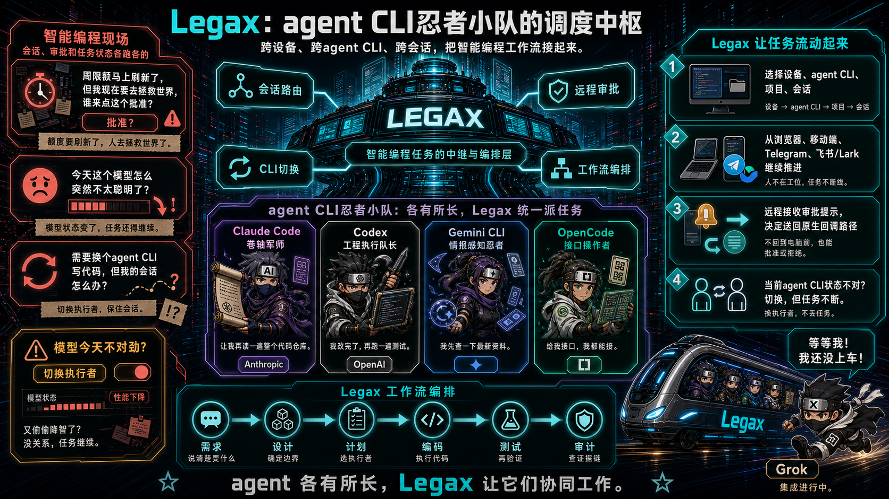
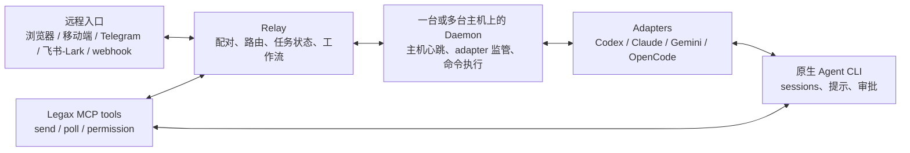

<div align="center">

<h1>Legax：跨设备、跨 Agent CLI 的远程操作、session 管理与工作流编排项目</h1>

<p>
  <a href="README.md">English</a> | 简体中文
</p>

<p><strong>Legax 把多台机器和多个 Agent CLI 接到同一个远程操作层里。你可以选择机器、CLI、项目和 session，回复问题，处理审批，交接任务，并用工作流编排较长的软件开发过程。</strong></p>

<p>
  当前支持的 Agent CLI：Codex CLI、Claude Code、Gemini CLI、OpenCode。
</p>

<p>
  <a href="https://www.npmjs.com/package/legax"></a>
  <a href="LICENSE"></a>
  <a href="https://codespaces.new/zhanex/legax"></a>
</p>

<p>
  
</p>

</div>

## 一句话说明

Legax 是给同时使用多个 Agent CLI 的人准备的控制层。

问题很直接：每个 Agent CLI 都有自己的 session 列表、审批提示、输出方式和继续任务的方式。如果你还在多台机器上跑 Agent，这些选择会继续分散到不同设备上。任务一长，或者人离开主终端后，就很难判断哪个 session 需要处理、下一句话应该发到哪里。

Legax 把这些决策集中到一个远程 session 层。你可以从浏览器、移动端、Telegram、飞书/Lark 或 webhook 选择目标机器、Agent CLI、项目和 session，再把下一步指令送回正确的位置。

## 你可以用它做什么

- 在多台机器连接同一个 relay 时，远程继续正确的 Agent CLI session。
- 把回复发回选中的 CLI、项目/聊天和 session。
- 查看受支持的原生审批提示，并通过 Agent 自己的回调路径返回同意或拒绝。
- 用 Legax 任务身份跟踪较长任务，包括 session 历史、generation、lease、handoff、fork 和加密 checkpoint。
- 在任务变化或某个工具更适合时，把工作切到其他受支持的 Agent CLI 或 daemon host。
- 通过工作流编排，以工程化方式定义软件开发流程，并让合适的 CLI 执行合适的任务。

## 为什么这件事重要

很多 remote 工具的第一层能力是连终端或托管运行。Legax 的第一层能力是围绕任务管理：哪个 Agent CLI、哪个项目、哪个 session、哪次审批、哪次交接、哪份验收证据。

这种取向带来几个直接差异：

| 需求 | Legax 的做法 |
| --- | --- |
| 远程访问 | 使用浏览器配对、移动端入口、Telegram、飞书/Lark 或 webhook 动作。 |
| 跨设备 session 同步 | 多台 daemon host 可以连接同一个 relay；relay 管理的任务/session 身份、lease、handoff 和 checkpoint 能在这些主机之间可见。各 CLI 的原生历史仍归各 CLI。 |
| Session 管理 | 按机器、Agent CLI、项目/聊天和 session 路由，摆脱按终端窗口找会话的模式。 |
| 审批处理 | 通过受支持的 Agent 原生回调路径镜像审批提示。 |
| 较长任务 | 在 relay store 中跟踪任务身份、lease、handoff、fork、checkpoint 和收件箱事项。 |
| 工作流编排 | 以工程化方式定义软件开发流程，并把不同步骤交给更合适的 CLI 执行。 |
| 多 Agent CLI | 通过一个 daemon 管理多个 adapter，并从远程层切换目标。 |

## 30 秒试用

只想创建配置并验证本地运行环境时，可以用 `npx`：

```bash
npx legax@latest init
npx legax@latest doctor --offline
```

如果要体验本地配对，把 relay 和 daemon 分别放在两个终端：

```bash
# 终端 1
npx legax@latest relay start
```

```bash
# 终端 2
npx legax@latest daemon start:bg
npx legax@latest daemon pair
```

用浏览器或移动设备打开输出的 pair URL，也可以扫描二维码。如果交互设备不在同一台机器或局域网，relay 必须能被它访问；分离式 relay 部署见[用户手册](docs/USER_MANUAL.zh-CN.md)。

Telegram 和飞书/Lark 都是可选通道。启用 relay 通道后，Telegram 轮询或 webhook、飞书/Lark 回调、出站消息分发和消息路由都由 relay 负责。daemon 或 adapter 直连 Telegram 只保留为没有 relay 时的兜底路径。

## 当前能力

| 范围 | 当前支持 |
| --- | --- |
| Agent CLI | Codex CLI、Claude Code、Gemini CLI、OpenCode |
| 远程入口 | Relay Web UI、浏览器配对、移动端浏览器、Telegram Bot API、飞书/Lark 自建应用 bot、outbound webhook 通知 |
| 跨设备 session 同步 | 多台 daemon host 可以连接同一个 relay；relay 管理的 session、generation、lease、handoff、fork 和 checkpoint 在这些主机之间可见 |
| Session 路由 | 在 relay、Telegram 和飞书/Lark 动作中选择 CLI、项目/聊天和 session |
| Relay 管理的任务状态 | Session、generation、lease、handoff、fork、加密 checkpoint artifact、收件箱事项 |
| 工作流编排 | 受限 workflow DSL、内置 LPS TDD 动作、审批门、重试、验收证据、relay 命令队列 |
| 原生审批 | Codex JSON-RPC、Claude permission-prompt MCP、Gemini CLI approval mode |
| 运行时状态 | 本地 JSON 状态，保存 adapter cursor、选中 session、inbox 队列和启动请求 |
| Codex 插件 | 可安装插件包，包含 Legax skill 和 MCP 工具 |

OpenCode 文本路由通过 `opencode serve` 工作；OpenCode 原生权限回调桥接尚未实现。

## 工作方式



Legax 运行时有四类角色：

- Relay：放在操作者选择的机器、VPS、NAS 或服务器上。它负责远程入口、配对设备、消息路由、收件箱事项、任务 session、generation、lease、handoff、artifact、workflow definition/run、已连接主机和主机命令。
- Daemon：放在安装了 Agent CLI 的开发机上。多台 daemon host 可以连接同一个 relay。每个 daemon 发送主机心跳，监管本机 adapters，拉取远程消息，认领白名单 command ref，并把结果写回 relay。
- Adapter：每个 Agent CLI 一个 adapter。它负责列出 session、选择 session、向 CLI 注入文本、解析结构化输出，并在可用时镜像原生审批回调。
- MCP capability server：向宿主 Agent 暴露 `send`、`poll`、`request_permission` 和 `status` 工具。它只提供能力；进程生命周期由 daemon 管理。

## 日常安装

在运行编码 Agent 的机器上安装一体化 CLI：

```bash
npm install -g legax
legax init
legax doctor --offline
legax relay start
legax daemon start:bg
legax daemon pair
```

`legax init` 默认会在 Legax home 目录下写入 `config.yaml`。可以设置 `LEGAX_HOME` 选择其他由操作者拥有的目录，也可以对单次命令传入 `--config <path>`。

## 让 AI 帮你安装

把下面这段提示词复制给你的编码 Agent：

```text
Install and configure Legax for me.

Use the AI-facing install guide as your execution checklist:
- If you are working in a local Legax checkout, read docs/AI_INSTALL.md.
- Otherwise, read https://github.com/zhanex/legax/blob/main/docs/AI_INSTALL.md.

Follow the guide exactly. Do not print secrets or commit local config/runtime files. Ask me before creating DNS records, exposing ports, rotating secrets, changing npm auth, or selecting a Telegram or Feishu/Lark chat. Finish by running the validation commands from the guide and summarize the config paths, enabled transports, enabled agent CLIs, and any remaining manual steps.
```

## 当前边界和路线图

Legax 当前已经覆盖远程 session 路由、受支持 adapter 的原生审批镜像、跨已连接主机的 relay 任务状态，以及受限 workflow run。更高层的调度还在路线图中：

- 在多个已订阅的 Agent 计划之间分配任务，同时保留项目上下文；
- 把不同工作流步骤交给更适合该步骤的 CLI 和模型；
- 当某个 CLI 降智、异常或暂时受限时，把任务切换到其他可用 CLI；
- 把成本、质量、可用性和上下文连续性变成明确的路由信号。

## 开发者入口

| 需求 | 从这里开始 |
| --- | --- |
| 最小配置 | [examples/config.example.minimal.zh-CN.yaml](examples/config.example.minimal.zh-CN.yaml) |
| 示例说明 | [examples/README.zh-CN.md](examples/README.zh-CN.md) |
| 完整安装指南 | [docs/USER_MANUAL.zh-CN.md](docs/USER_MANUAL.zh-CN.md) |
| 面向 AI 的安装指南 | [docs/AI_INSTALL.zh-CN.md](docs/AI_INSTALL.zh-CN.md) |
| Adapter 行为 | [docs/ADAPTERS.zh-CN.md](docs/ADAPTERS.zh-CN.md) |
| Claude Code 集成审查 | [docs/CLAUDE_CODE_INTEGRATION.zh-CN.md](docs/CLAUDE_CODE_INTEGRATION.zh-CN.md) |
| Adapter 一致性清单 | [docs/ADAPTER_CONFORMANCE.zh-CN.md](docs/ADAPTER_CONFORMANCE.zh-CN.md) |
| 工程规则 | [docs/ENGINEERING_GUIDE.zh-CN.md](docs/ENGINEERING_GUIDE.zh-CN.md) |
| 配置契约 | [docs/CONFIGURATION.zh-CN.md](docs/CONFIGURATION.zh-CN.md) |
| Relay HTTP API | [docs/RELAY_API.zh-CN.md](docs/RELAY_API.zh-CN.md) |
| Relay 状态模型 | [docs/RELAY_STORE.zh-CN.md](docs/RELAY_STORE.zh-CN.md) |
| Runtime state schema | [docs/RUNTIME_STATE.zh-CN.md](docs/RUNTIME_STATE.zh-CN.md) |
| 协议与工作流契约 | [docs/LEGAX_PROTOCOL.zh-CN.md](docs/LEGAX_PROTOCOL.zh-CN.md) |
| 状态机 | [docs/STATE_MACHINES.zh-CN.md](docs/STATE_MACHINES.zh-CN.md) |
| 兼容性矩阵 | [docs/COMPATIBILITY.zh-CN.md](docs/COMPATIBILITY.zh-CN.md) |
| 可观测性规则 | [docs/OBSERVABILITY.zh-CN.md](docs/OBSERVABILITY.zh-CN.md) |
| 架构决策 | [docs/adr/README.zh-CN.md](docs/adr/README.zh-CN.md) |
| 架构 | [docs/ARCHITECTURE.zh-CN.md](docs/ARCHITECTURE.zh-CN.md) |
| AI/LLM 仓库上下文 | [docs/context_for_llms.zh-CN.md](docs/context_for_llms.zh-CN.md) |
| Codespaces | [在 Codespaces 中打开仓库](https://codespaces.new/zhanex/legax) |

这是一个零依赖 Node.js 项目。所有内容都基于 Node 18+ 标准库运行。

## 常用命令

| 命令 | 用途 |
| --- | --- |
| `legax init` | 创建操作者配置，并生成本地密钥。 |
| `legax doctor --offline` | 不检查 relay 网络，只验证本地配置和已启用 CLI 命令。 |
| `legax relay start` | 启动开发用 relay。 |
| `legax daemon start` | 在前台启动统一 daemon 和已启用 adapter。 |
| `legax daemon start:bg` | 后台启动 daemon，适合本地 demo 和配对。 |
| `legax daemon pair` | 输出短期配对 URL 和二维码 payload。 |
| `legax doctor` | relay 可达后运行完整诊断。 |

## 部署方式

| 部署 | 适用场景 |
| --- | --- |
| 本机一体化 | 在一台机器上试用 Legax，或交互设备能访问你配置的 relay URL。 |
| Relay 与 daemon 分离 | 公网 VPS、NAS 或服务器托管 relay，Agent CLI 留在私有开发机上。 |
| Telegram 优先 | 相比浏览器 relay UI，你更偏好 Telegram 消息和按钮。 |
| 飞书/Lark 优先 | 团队使用飞书中国区或 Lark 国际区处理工作通知。 |

项目维护者不运营托管后端、共享 relay、共享 Telegram bot 或共享飞书/Lark 应用。数据流向由你通过 transport 配置决定。

## Codex 插件

本仓库也已经按可安装 Codex 插件组织：

- [`.codex-plugin/plugin.json`](.codex-plugin/plugin.json) 是插件清单。
- [`.mcp.json`](.mcp.json) 注册 Legax MCP server。
- [`skills/legax/SKILL.md`](skills/legax/SKILL.md) 告诉 Codex 何时以及如何使用 Legax relay 工具。
- [`.agents/plugins/marketplace.json`](.agents/plugins/marketplace.json) 通过仓库 marketplace 暴露根目录插件，便于本地或团队测试。

安装命令、发布候选检查项和当前官方 Plugin Directory 状态见 [Codex 插件指南](docs/CODEX_PLUGIN.zh-CN.md)。

## 安全模型

Legax 会处理敏感的本地 Agent 上下文、审批请求、路径，有时还包括命令输出。

- 密钥保存在本地 YAML 配置中，不写入受跟踪示例文件，也不依赖环境变量兜底。
- 浏览器访问使用短期配对码和已配对设备 cookie，不使用 URL token。
- 审批决策会通过受支持的原生回调返回。
- Legax 不能模拟 UI 点击、自动批准提示，或绕过 Agent 的安全策略。

公开暴露 relay 前，请阅读[隐私说明](docs/PRIVACY.zh-CN.md)、[安全策略](.github/SECURITY.zh-CN.md)和[功能边界](docs/FUNCTIONAL_BOUNDARIES.zh-CN.md)。

## 文档

| 需求 | 阅读 |
| --- | --- |
| 安装和运行 Legax | [用户手册](docs/USER_MANUAL.zh-CN.md) |
| 让 Agent 帮你安装 Legax | [AI 安装指南](docs/AI_INSTALL.zh-CN.md) |
| 理解 adapter 行为 | [Adapter 指南](docs/ADAPTERS.zh-CN.md) |
| 审查 Claude Code 集成 | [Claude Code 集成](docs/CLAUDE_CODE_INTEGRATION.zh-CN.md) |
| 安装或审查 Codex 插件 | [Codex 插件指南](docs/CODEX_PLUGIN.zh-CN.md) |
| 理解架构 | [架构](docs/ARCHITECTURE.zh-CN.md) |
| 遵循工程约定 | [工程规范](docs/ENGINEERING_GUIDE.zh-CN.md) |
| 为代码变更选择文档和测试 | [变更矩阵](docs/CHANGE_MATRIX.zh-CN.md) |
| 审查配置字段 | [配置契约](docs/CONFIGURATION.zh-CN.md) |
| 审查 Relay HTTP API | [Relay API](docs/RELAY_API.zh-CN.md) |
| 理解 relay 管理的状态 | [Relay Store](docs/RELAY_STORE.zh-CN.md) |
| 理解本地 runtime state | [Runtime State](docs/RUNTIME_STATE.zh-CN.md) |
| 理解协议与工作流 | [Legax 协议](docs/LEGAX_PROTOCOL.zh-CN.md) |
| 审查状态转换 | [状态机](docs/STATE_MACHINES.zh-CN.md) |
| 检查外部兼容性 | [兼容性矩阵](docs/COMPATIBILITY.zh-CN.md) |
| 理解产品边界 | [功能边界](docs/FUNCTIONAL_BOUNDARIES.zh-CN.md) |
| 审查 adapter 要求 | [Adapter 一致性要求](docs/ADAPTER_CONFORMANCE.zh-CN.md) |
| 扩展项目 | [扩展 Legax](docs/EXTENDING.zh-CN.md) |
| 审查可观测性规则 | [可观测性](docs/OBSERVABILITY.zh-CN.md) |
| 发布包 | [发布指南](docs/RELEASE.zh-CN.md) |

## 开发

```bash
npm run ci
```

`npm run ci` 是完整合并门禁。做定向修改时，先跑窄回归测试，再跑相关的更大门禁。

常用检查：

```bash
npm test
npm run check:node
npm run check:docs
npm run test:e2e
node scripts/legax-daemon.mjs --dry-run
```

如果新增脚本或 E2E 文件，需要追加到 `package.json` 中的显式列表。

## 贡献

提交 PR 前请阅读[贡献指南](.github/CONTRIBUTING.zh-CN.md)。Bug 和功能请求使用 GitHub issue。安全报告必须使用[安全策略](.github/SECURITY.zh-CN.md)中的私密流程，不要公开 issue。

文档和配置示例必须成对提供英文与简体中文版本。修改文档后运行 `npm run check:docs`。
