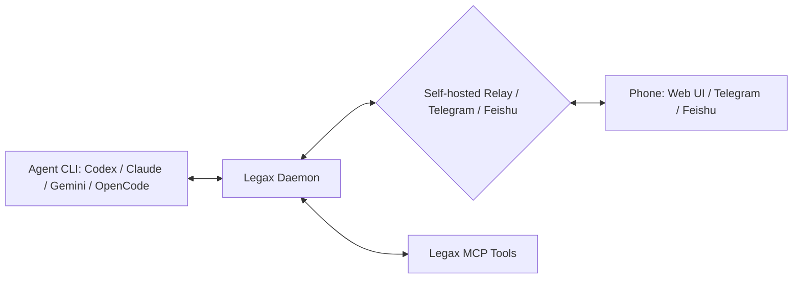

<div align="center">

<h1>Legax：AI Coding Agent 通用遥控器与 Relay</h1>

<p>
  <a href="README.md">English</a> | 简体中文
</p>

<p><strong>用手机或任意设备控制 Codex、Claude Code、Gemini CLI 和 OpenCode。</strong></p>

<p>
  Legax 是面向 AI 编码 Agent 的 local-first 远程控制层。它会把重要 Agent 事件转发到手机，把回复路由回选中的 CLI/项目/会话，并通过各 Agent 的原生回调路径返回受支持的审批决策。
</p>

<p>
  <a href="https://www.npmjs.com/package/legax"></a>
  <a href="LICENSE"></a>
  <a href="https://codespaces.new/zhanex/legax"></a>
</p>

<p>
  
</p>

</div>

## 30 秒试用

只想创建配置并验证本地运行环境时，可以用 `npx`：

```bash
npx legax@latest init
npx legax@latest doctor --offline
```

如果要跑一个本地手机配对 Demo，把 relay 和 daemon 放在两个终端：

```bash
# 终端 1
npx legax@latest relay start
```

```bash
# 终端 2
npx legax@latest daemon start:bg
npx legax@latest daemon pair
```

用手机打开输出的 pair URL，或扫描二维码。如果真实手机不在同一台机器或局域网，relay 必须能被手机访问；分离式 relay 部署见[用户手册](docs/USER_MANUAL.zh-CN.md)。

## 开发者为什么会想用

编码 Agent 经常会在你离开桌面后需要关注：权限提示、澄清问题、任务完成通知，或一个想从别处继续的会话。Legax 把这条回路留在你自己控制的基础设施上。

| 问题 | Legax 路径 |
| --- | --- |
| 离开电脑后错过审批提示。 | 把受支持的原生审批转发到手机，并通过 Agent 回调返回决策。 |
| 需要远程继续本地会话。 | 将手机回复路由到选中的 CLI、项目和会话。 |
| 想要手机访问，但不想暴露终端控制。 | 使用 relay 配对、Telegram/飞书按钮和 adapter API，而不是抓取 UI。 |
| 团队同时使用多个 Agent CLI。 | 在一个 daemon 下运行 Codex、Claude Code、Gemini CLI 和 OpenCode 适配器。 |

## 功能矩阵

| 功能 | Codex CLI | Claude Code CLI | Gemini CLI | Legax |
| --- | --- | --- | --- | --- |
| 手机或浏览器远程控制 | 受限于原生界面 | 没有通用手机 relay | 没有通用手机 relay | Web UI、Telegram、飞书/Lark、webhook |
| 多 Agent 路由 | 否 | 否 | 否 | Codex、Claude Code、Gemini CLI、OpenCode |
| 自托管 relay | 否 | 否 | 否 | 是 |
| 跨设备会话选择 | 否 | 否 | 否 | CLI、项目/聊天、会话菜单 |
| 原生审批镜像 | 仅 Codex | 仅 Claude | 仅 Gemini | 跨 adapter 支持的原生路径 |
| 面向 Agent 工作流的 MCP 工具 | 宿主特定 | 宿主特定 | 宿主特定 | 通用 Legax MCP server |

OpenCode 文本路由通过 `opencode serve` 工作；OpenCode 原生权限回调桥接尚未实现。

## 工作方式



daemon 负责进程监督、远程入站路由、会话选择和按需启动。adapter 负责各自 CLI 的生命周期和会话模型。MCP 工具只是 Agent 能力层，不是生命周期管理器。

## 日常安装

在运行编码 Agent 的机器上安装一体化 CLI：

```bash
npm install -g legax
legax init
legax doctor --offline
legax relay start
legax daemon start:bg
legax daemon pair
```

`legax init` 默认会在 Legax home 目录下写入 `config.yaml`。可以设置 `LEGAX_HOME` 选择其他由操作者拥有的目录，也可以对单次命令传入 `--config <path>`。

## 让 AI 帮你安装

把下面这段提示词复制给你的编码 Agent：

```text
Install and configure Legax for me.

Use the AI-facing install guide as your execution checklist:
- If you are working in a local Legax checkout, read docs/AI_INSTALL.md.
- Otherwise, read https://github.com/zhanex/legax/blob/main/docs/AI_INSTALL.md.

Follow the guide exactly. Do not print secrets or commit local config/runtime files. Ask me before creating DNS records, exposing ports, rotating secrets, changing npm auth, or selecting a Telegram or Feishu/Lark chat. Finish by running the validation commands from the guide and summarize the config paths, enabled transports, enabled agent CLIs, and any remaining manual steps.
```

## 当前能力

| 范围 | 当前支持 |
| --- | --- |
| Agent 适配器 | Codex、Claude Code、Gemini CLI、OpenCode |
| 手机传输 | 自托管 relay Web UI、Telegram Bot API、飞书/Lark 自建应用 bot、outbound webhook 通知 |
| 原生审批 | Codex JSON-RPC、Claude permission-prompt MCP、Gemini CLI approval mode |
| 会话路由 | 在 relay、Telegram 和飞书/Lark 动作中选择 CLI、项目/聊天和会话 |
| Codex 插件 | 可安装插件包，包含 Legax skill 和 MCP 工具 |
| 运行时状态 | 本地 JSON 状态，保存 adapter cursor、选中会话、inbox 队列和启动请求 |

## 开发者体验

| 需求 | 从这里开始 |
| --- | --- |
| 最小配置 | [examples/config.example.minimal.zh-CN.yaml](examples/config.example.minimal.zh-CN.yaml) |
| 示例说明 | [examples/README.zh-CN.md](examples/README.zh-CN.md) |
| 完整安装指南 | [docs/USER_MANUAL.zh-CN.md](docs/USER_MANUAL.zh-CN.md) |
| AI/LLM 仓库上下文 | [docs/context_for_llms.zh-CN.md](docs/context_for_llms.zh-CN.md) |
| Codespaces | [在 Codespaces 中打开仓库](https://codespaces.new/zhanex/legax) |

这是一个零依赖 Node.js 项目。所有内容都基于 Node 18+ 标准库运行。

## 常用命令

| 命令 | 用途 |
| --- | --- |
| `legax init` | 创建操作者配置，并生成本地密钥。 |
| `legax doctor --offline` | 不检查 relay 网络，只验证本地配置和已启用 CLI 命令。 |
| `legax relay start` | 启动开发用 relay。 |
| `legax daemon start` | 在前台启动统一 daemon 和已启用 adapter。 |
| `legax daemon start:bg` | 后台启动 daemon，适合本地 Demo 和配对。 |
| `legax daemon pair` | 输出短期手机配对 URL 和二维码 payload。 |
| `legax doctor` | relay 可达后运行完整诊断。 |

## 部署方式

| 部署 | 适用场景 |
| --- | --- |
| 本机一体化 | 在一台机器上试用 Legax，或手机能访问你配置的 relay URL。 |
| Relay 与 daemon 分离 | 公网 VPS、NAS 或服务器托管 relay，Agent CLI 留在私有开发机上。 |
| Telegram 优先 | 相比浏览器 relay UI，你更偏好 Telegram 消息和按钮。 |
| 飞书/Lark 优先 | 团队使用飞书中国区或 Lark 国际区处理移动工作通知。 |

项目维护者不运营托管后端、共享 relay、共享 Telegram bot 或共享飞书/Lark 应用。数据流向由你通过 transport 配置决定。

## Codex 插件

本仓库也已经按可安装 Codex 插件组织：

- [`.codex-plugin/plugin.json`](.codex-plugin/plugin.json) 是插件清单。
- [`.mcp.json`](.mcp.json) 注册 Legax MCP server。
- [`skills/legax/SKILL.md`](skills/legax/SKILL.md) 告诉 Codex 何时以及如何使用手机 relay 工具。
- [`.agents/plugins/marketplace.json`](.agents/plugins/marketplace.json) 通过仓库 marketplace 暴露根目录插件，便于本地或团队测试。

安装命令、发布候选检查项和当前官方 Plugin Directory 状态见 [Codex 插件指南](docs/CODEX_PLUGIN.zh-CN.md)。

## 安全模型

Legax 会处理敏感的本地 Agent 上下文、审批请求、路径，有时还包括命令输出。

- 密钥保存在本地 YAML 配置中，不写入受跟踪示例文件，也不依赖环境变量兜底。
- 浏览器访问使用短期配对码和已配对设备 cookie，不使用 URL token。
- 审批决策会通过受支持的原生回调返回。
- Legax 不能模拟 UI 点击、自动批准提示，或绕过 Agent 的安全策略。

公开暴露 relay 前，请阅读[隐私说明](docs/PRIVACY.zh-CN.md)、[安全策略](.github/SECURITY.zh-CN.md)和[功能边界](docs/FUNCTIONAL_BOUNDARIES.zh-CN.md)。

## 文档

| 需求 | 阅读 |
| --- | --- |
| 安装和运行 Legax | [用户手册](docs/USER_MANUAL.zh-CN.md) |
| 让 Agent 帮你安装 Legax | [AI 安装指南](docs/AI_INSTALL.zh-CN.md) |
| 理解适配器行为 | [适配器指南](docs/ADAPTERS.zh-CN.md) |
| 安装或审查 Codex 插件 | [Codex 插件指南](docs/CODEX_PLUGIN.zh-CN.md) |
| 理解架构 | [架构](docs/ARCHITECTURE.zh-CN.md) |
| 理解产品边界 | [功能边界](docs/FUNCTIONAL_BOUNDARIES.zh-CN.md) |
| 扩展项目 | [扩展 Legax](docs/EXTENDING.zh-CN.md) |
| 发布包 | [发布指南](docs/RELEASE.zh-CN.md) |

## 开发

```bash
npm run ci
```

`npm run ci` 是完整合并门禁。做定向修改时，先跑窄回归测试，再跑相关的更大门禁。

常用检查：

```bash
npm test
npm run check:node
npm run check:docs
npm run test:e2e
node scripts/legax-daemon.mjs --dry-run
```

如果新增脚本或 E2E 文件，需要追加到 `package.json` 中的显式列表。

## 贡献

提交 PR 前请阅读[贡献指南](.github/CONTRIBUTING.zh-CN.md)。Bug 和功能请求使用 GitHub issue。安全报告必须使用[安全策略](.github/SECURITY.zh-CN.md)中的私密流程，不要公开 issue。

文档和配置示例必须成对提供英文与简体中文版本。修改文档后运行 `npm run check:docs`。
