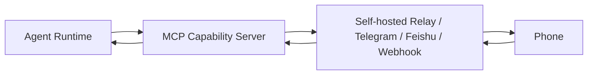
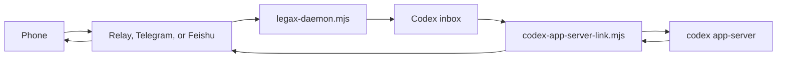
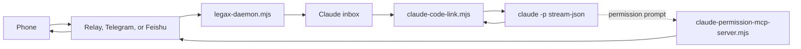
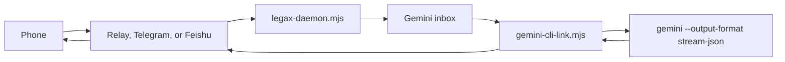
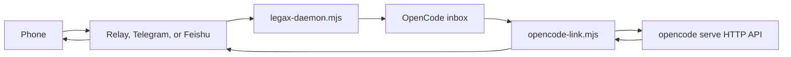
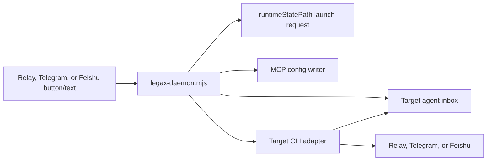

# Legax Architecture

English | [Simplified Chinese](ARCHITECTURE.zh-CN.md)

Legax is a local-first relay layer between coding agent runtimes and phone-side communication channels. The project uses a generic event model so that Codex, Claude Code, Gemini CLI, OpenCode, and future adapters can share the same relay, routing, approval, and notification infrastructure.

## Design Goals

- Keep the runtime local by default.
- Let users self-host the relay or configure a third-party transport.
- Support bidirectional text, approval decisions, and user-input requests.
- Keep the project agent-neutral.
- Prefer structured CLI protocols over terminal screen parsing.
- Keep MCP as an agent capability layer, not the primary lifecycle manager.

## Architecture Rule: CLI + MCP

CLI is the control plane:

- Start, stop, and restart agent processes.
- Own session selection and continuation.
- Parse structured output and completion events.
- Handle cancellation and timeouts.
- Keep agent-specific adapter logic isolated.

MCP is the capability plane:

- Expose remote approval tools.
- Expose remote input tools.
- Expose remote notification tools.
- Integrate with agent-native permission prompt hooks when available.

Communication transports are the phone plane:

- Self-hosted relay.
- Telegram Bot API.
- Feishu/Lark app bot.
- Outbound webhook.

TUI or PTY hosting is a fallback backend only. It is useful when a CLI has no structured mode, but it is more fragile for permissions, completion detection, and session listing.

## Components

1. Plugin manifest
   - `.codex-plugin/plugin.json`
   - Registers the project as a Codex plugin while keeping the name and protocol agent-neutral.

2. Generic MCP capability server
   - `scripts/mcp-server.mjs`
   - Runs over stdio.
   - Exposes `legax_send`, `legax_poll`, `legax_request_permission`, and `legax_status`.
   - Reads `config.yaml`.
   - Stores MCP state under `storagePath`.

3. Self-hosted relay
   - `scripts/simple-relay-server.mjs`
   - Shares HTTP, store, pairing, TWA, Feishu, and browser behavior through `scripts/lib/relay-server-core.mjs`.
   - Packaged by `self-hosted-relay/` for Linux installs as a thin launcher plus the shared relay core files.
   - Provides desktop APIs, phone APIs, and a phone web page.
   - Routes inbound phone messages by `targetAgentId`.
   - Stores relay state under `relay.storePath`; the default is `./data/relay-store.json` for the development relay and `/var/lib/legax-relay/relay-store.json` for the standalone relay.
   - Uses the first formal relay store schema, `legax.relay/1`. This is not a "V2" format; Legax has not shipped a stable V1 release.
   - Owns portable relay session state, including sessions, generations, leases, hosts, devices, transports, inbox entries, commands, metadata events, artifacts, and workflow definitions/runs. See [Relay Store](RELAY_STORE.md).

4. Third-party transports
   - Telegram supports outbound messages, inbound polling, inline CLI/project/session buttons, and approval buttons.
   - Telegram outbound delivery can be filtered at daemon, CLI, and transport layers (`daemon.notifications`, `codex/claude/gemini/opencode.notifications`, and `transports[].notifications`). Filtering is transport-local; the relay can still keep the full event stream.
   - Telegram messages are HTML-formatted and split into multiple `sendMessage` calls before Telegram's message length limit.
   - Feishu/Lark supports outbound app-bot messages, interactive approval cards, and inbound event callbacks through the relay's `/api/feishu/events` endpoint.
   - Feishu/Lark delivery can be filtered with the same `messageDetail` policy shape through `transports[].notifications` or `transports[].feishuNotifications`.
   - Generic webhook supports outbound event delivery to custom services.
   - Only one Telegram poller should read `getUpdates` for a shared bot; messages are queued by `targetAgentId`.

5. Codex agent
   - Canonical config key: `codex`.
   - CLI backend: `app-server-ws` for the shared local websocket backend; `app-server-proxy` for a manually exposed control socket; `app-server` for an adapter-owned stdio backend.
   - MCP role: supplemental capability tools.
   - Connects to an existing shared `codex app-server --listen ws://...` endpoint in existing-session mode, and can start that shared server with `sharedServerMode: connect-or-start`.
   - Uses JSON-RPC to list, resume, and start threads; start or steer turns; receive structured output; and answer approval requests.
   - Handles `item/.../requestApproval` methods.
   - Uses low-noise notifications by default.

6. Claude agent
   - Canonical config key: `claude`.
   - CLI backend: `stream-json`.
   - MCP role: permission prompt and supplemental capability tools.
   - Starts Claude Code print mode with stream-json input/output.
   - In existing-session mode, adds `--continue` or `--resume <id>` so remote turns land in persisted Claude Code history.
   - Lists persisted project sessions from Claude Code's local JSONL history and restarts the stream-json process when a different session is selected.
   - Uses `scripts/claude-permission-mcp-server.mjs` as a permission prompt tool.
   - Sends phone messages into Claude Code stdin.

7. Gemini agent
   - Canonical config key: `gemini`.
   - CLI backend: `stream-json`.
   - MCP role: supplemental capability tools.
   - Starts one Gemini CLI headless turn per phone message.
   - In existing-session mode, adds `--resume latest` or `--resume <id>` so remote turns land in persisted Gemini CLI history.
   - Lists sessions through `gemini --list-sessions` and stores the selected resume target for following headless turns.
   - Passes phone text through `--prompt` by default.
   - Mirrors tool events as status updates.
   - Sets `GEMINI_CLI_TRUST_WORKSPACE=true` when `trustWorkspace: true` is configured, which is required for daemon/headless use in untrusted directories.
   - Permission behavior is currently controlled by Gemini CLI approval mode.

8. OpenCode agent
   - Canonical config key: `opencode`.
   - CLI backend: `server-http`.
   - Connects to OpenCode's headless HTTP server at `opencode.serverUrl`, or starts `opencode serve` when `serverMode: connect-or-start`.
   - Lists OpenCode sessions through `GET /session`, reads selected-session history through `GET /session/:id/message`, and sends phone text through `POST /session/:id/message`.
   - Uses OpenCode Basic Auth when `serverPassword` is configured. The username defaults to `opencode`.
   - OpenCode-native permission callback bridging is not implemented yet.

9. Unified daemon
   - `scripts/legax-daemon.mjs`
   - Reads the same YAML config and supervises all enabled CLI adapters.
   - Keeps concurrent Codex, Claude, Gemini, and OpenCode work in one relay session.
   - Owns relay, Telegram, and Feishu/Lark-backed inbound routing while running, so remote menus and on-demand launches do not depend on any specific adapter being alive.
   - Restarts crashed adapters with bounded backoff unless `daemon.restart: false`.
   - Watches runtime launch requests and starts `autoStart: false` adapters when third-party or phone actions target them.
   - Writes adapter-specific MCP config before launching Claude Code or Gemini CLI when `mcpAutoConfigure` is enabled.
   - Preserves launch-triggering control messages, so selecting an adapter that is not running still returns its project/chat or session list after startup.

10. Runtime state
   - `scripts/lib/runtime-state.mjs`
   - Persists adapter cursors, dynamic modes, Telegram selections, selected Codex thread metadata, and per-agent inbound queues under `runtimeStatePath`.
   - Remains local daemon/adapter coordination state. It is not the source of truth for portable relay-owned sessions.
   - Prevents old phone messages from replaying after restart.
   - Uses a retrying atomic rename to tolerate concurrent adapter writes on Windows.

## Data Flow

Generic MCP path:



Codex path:



Claude path:



Gemini path:



OpenCode path:



On-demand launch path:



## Runtime Modes

- `interactive`: phone text and phone approval decisions are accepted.
- `approval-only`: phone approval decisions are accepted; phone text is ignored.
- `monitor`: output is forwarded; phone text and approvals are ignored.
- `paused`: phone text and approvals are ignored until another control message changes mode.
- `autoStart: false`: leaves an adapter visible in menus but starts it on demand through daemon launch requests.
- `useExisting: true`: prefers an existing app-server or persisted CLI session instead of creating an unrelated history target.

Phone approval decisions are only honored in `interactive` and `approval-only`.

Codex existing-session mode uses the shared websocket app-server path. Start the visible Codex CLI with `codex --remote ws://127.0.0.1:18779` to attach it to the same backend as Legax. The desktop app's embedded stdio app-server does not expose the local control socket by default, so it should not be treated as the shared backend unless Codex exposes a supported local remote-control listener. Claude Code and Gemini CLI currently expose resume-oriented history reuse rather than a stable API for writing into an already-open TUI, so their existing-session mode preserves local history but may not live-update a separate foreground TUI. OpenCode exposes a server API, so Legax can send turns to a selected OpenCode server session without scraping the TUI.
Selecting a Claude Code, Gemini CLI, or OpenCode adapter from Telegram or the phone page activates `interactive` mode unless the adapter is explicitly `paused`, then returns a project/chat picker before the session list. The Telegram and relay web buttons use generic `legax:agent:<agentId>`, `legax:projects:<agentId>`, `legax:project:<agentId>:<projectRef>`, `legax:sessions:<agentId>`, `legax:session:<agentId>:<sessionRef>`, `legax:new:<agentId>`, and `legax:new-project:<agentId>` callbacks. `legax:new-project` is daemon-owned: it preflights relay HTTPS reachability, creates a short-lived TWA launch token, and only then sends the Web App button that lets the user choose from daemon-configured local `projectRoots`.

## Routing Priority

When several adapters share one transport (for example: one Telegram bot or Feishu app routing to Codex / Claude / Gemini / OpenCode in the same process tree), two distinct decisions are made:

**1. Which agent is the inbound message for?**

The daemon remote router resolves a target agent in this order while the daemon is running; standalone adapters use the same rules when `daemon.remoteRouter: false`:

1. `message.targetAgentId` set on the inbound message itself (phone web UI buttons, Telegram inline callbacks, Feishu card values, and the relay's parsed `/use <agent>` syntax all set this).
2. Per-transport runtime selection — set when the phone or third-party user picks an agent via a control message; persisted in `runtimeStatePath` so it survives daemon restarts.
3. `transports[N].defaultTarget` configured for that specific transport.
4. `config.routing.defaultTarget` global fallback.
5. Special values: `"self"` → the receiving adapter's own `agentId`; `"none"` (or empty) → no default, the message is dropped if no per-message target exists.

The literal target `*`, `all`, or `broadcast` skips routing and delivers to every active agent (rejected when `routing.allowBroadcast: false`, except for control messages when `allowControlBroadcast: true`).

**2. Who polls remote inbound channels?**

With the unified daemon, `daemon.remoteRouter: true` is the default. The daemon owns relay `/api/messages` polling and Telegram `getUpdates`, writes routed messages into per-agent inbox queues, and creates launch requests for sleeping adapters. Feishu/Lark callbacks enter through the relay and then follow the same `/api/messages` path. Adapter processes launched by the daemon only drain their inbox, which keeps remote interaction independent of Codex or any other specific adapter.

If you run a single adapter without the daemon, only one process can hold the Telegram long-poll cursor; the others must yield. The standalone fallback resolution order is:

1. `transports[N].pollerAgentId` (per-transport config).
2. `config.routing.telegramPollerAgentId` (global).
3. `config.codex.agentId` if Codex is enabled.
4. The current adapter's own `agentId` (last resort).

## Security Model

- Prefer self-hosted relay for sensitive work.
- Use HTTPS when the relay is reachable over the internet.
- Keep the relay desktop secret separate from paired browser device cookies.
- Keep Bot API tokens and webhook secrets out of documentation and logs.
- Treat redaction as a guardrail, not a complete data-loss-prevention system.
- Do not auto-approve native security prompts by simulating UI clicks.
- TUI/PTY backends must be treated as high-trust remote terminal control.

## Testing

The E2E suite covers:

- Relay auth, cursors, routing, and session isolation.
- MCP send, poll, and permission requests.
- Codex dry-run, approval callbacks, user-input requests, and session selection.
- Claude stream-json bridging, permission prompt MCP, and persisted session selection.
- Gemini stream-json bridging, phone-driven mode switching, and CLI session selection.
- OpenCode server API bridging, project/chat/session selection, selected-session history replay, and new-session creation.
- Runtime state persistence.
- Daemon startup for concurrent adapters.

Run:

```bash
npm run ci
```

## Documentation

Documentation is split by language:

- English: `*.md`
- Simplified Chinese: `*.zh-CN.md`

See [Documentation Standards](DOCUMENTATION.md).
