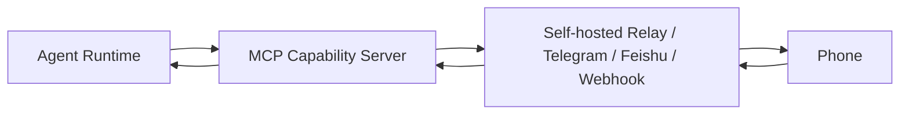
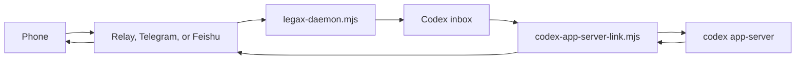
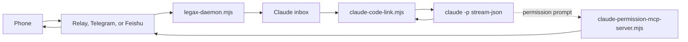
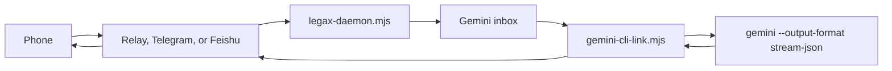
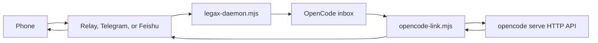
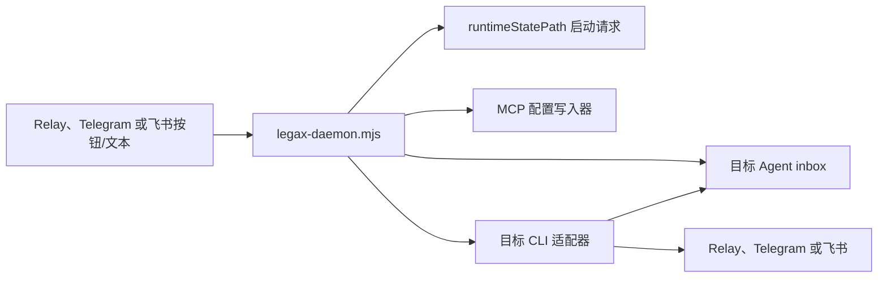

# Legax 架构

[English](ARCHITECTURE.md) | 简体中文

Legax 是面向 Agent CLI 的 session 管理与工作流编排层。项目使用通用事件模型，让已支持的 Agent CLI 和未来适配器共享同一套路由、审批、通知、relay store 和工作流基础设施。

## 设计目标

- 执行环境由操作者配置和掌控。
- 允许用户自部署 relay 或配置第三方通讯通道。
- 允许多台 daemon host 连接同一个 relay，由 relay 维护可迁移的任务/session 身份。
- 支持双向文本、权限决策和用户输入请求。
- 保持项目 Agent 中立。
- 优先使用结构化 CLI 协议，减少对终端屏幕解析的依赖。
- MCP 作为 Agent 能力层；进程生命周期由 CLI 控制面负责。

## 架构规则：CLI + MCP

CLI 是控制面：

- 启动、停止和重启 Agent 进程。
- 管理 session 选择和续接。
- 解析结构化输出和完成事件。
- 处理取消和超时。
- 隔离不同 Agent 的适配器逻辑。

MCP 是能力面：

- 暴露远程审批工具。
- 暴露远程输入工具。
- 暴露远程通知工具。
- 在可用时接入 Agent 原生权限提示 hook。

通信通道是远端交互平面：

- 自部署 relay。
- Telegram Bot API。
- 飞书/Lark 自建应用 bot。
- 出站 webhook。

TUI 或 PTY 托管只作为兜底 backend。它适合没有结构化模式的 CLI，但在权限识别、完成检测和 session 列表方面更脆弱。

## 组件

1. 插件清单
   - `.codex-plugin/plugin.json`
   - 以 Codex 插件形式注册项目，同时保持名称和协议 Agent 中立。

2. 通用 MCP 能力服务
   - `scripts/mcp-server.mjs`
   - 通过 stdio 运行。
   - 暴露 `legax_send`、`legax_poll`、`legax_request_permission` 和 `legax_status`。
   - 读取 `config.yaml`。
   - 将 MCP 状态保存到 `storagePath`。

3. 自部署 relay
   - `scripts/simple-relay-server.mjs`
   - 通过 `scripts/lib/relay-server-core.mjs` 共享 HTTP、状态存储、配对、TWA、Telegram、飞书和浏览器行为。
   - 由 `self-hosted-relay/` 打包为 Linux 安装器，只保留薄启动器和共享的 relay 核心文件。
   - 提供桌面端 API、远端交互 API 和浏览器 relay 页面。
   - 按 `targetAgentId` 路由远端入站消息。
   - 将 relay 状态保存到 `relay.storePath`；开发用 relay 默认是 `./data/relay-store.json`，独立部署 relay 默认是 `/var/lib/legax-relay/relay-store.json`。
   - 使用第一个正式 relay store schema：`legax.relay/1`。Legax 还没有发布稳定 V1，因此这里不使用 “V2” 这类版本名。
   - 维护可迁移的 relay 会话状态，包括会话、generation、lease、handoff、主机、设备、通道、收件箱、命令、元数据事件、artifact 和工作流定义/运行记录。参见 [Relay Store](RELAY_STORE.zh-CN.md)。
   - 将 Agent CLI 的原生 session id 作为 generation 元数据保存，不把它当成对外公开的 relay 会话身份。
   - 提供 relay 侧的主机注册表和命令队列。多台 daemon host 可以注册到同一个 relay；relay 记录主机心跳、命令是否可执行、认领状态、终态结果以及过期结果的拒绝记录。本地 daemon 只执行白名单内的命令。

4. 第三方通讯通道
   - Telegram 支持由 relay 接管的出站消息、`getUpdates` 轮询或 `/api/telegram/events` webhook、行内 CLI/项目/session 按钮和审批按钮。
   - Telegram 出站可在 daemon、CLI、transport 三层过滤（`daemon.notifications`、`codex/claude/gemini/opencode.notifications`、`transports[].notifications`）。过滤只影响 Telegram；relay 仍可保留完整事件流。
   - Telegram 消息会用 HTML 格式化，并在触碰 Telegram 长度限制前拆成多条 `sendMessage`。
   - 飞书/Lark 支持自建应用 bot 出站消息、交互式审批卡片，以及通过 relay 的 `/api/feishu/events` 端点接收入站事件回调。
   - 飞书/Lark 投递可通过 `transports[].notifications` 或 `transports[].feishuNotifications` 使用同样的 `messageDetail` 策略形状过滤。
   - 通用 webhook 支持向自定义服务投递出站事件。
   - 启用 relay 通道后，只应由 relay 读取 Telegram `getUpdates`。daemon 或适配器直连 Telegram 只作为没有 relay 时的兜底路径。

5. Codex Agent
   - 标准配置键：`codex`。
   - CLI 后端：共享本地 websocket 后端使用 `app-server-ws`；`app-server-proxy` 用于手动暴露 control socket 的场景；`app-server` 用于适配器自己持有的 stdio 后端。
   - MCP 角色：补充能力工具。
   - existing-session 模式会接入已有的共享 `codex app-server --listen ws://...` 端点，也可以通过 `sharedServerMode: connect-or-start` 自动启动该共享服务。
   - 通过 JSON-RPC 列出、恢复和启动 thread；启动或引导 turn；接收结构化输出；响应权限请求。
   - 支持 `item/.../requestApproval` 方法。
   - 默认使用低噪声通知。

6. Claude Agent
   - 标准配置键：`claude`。
   - CLI 后端：`stream-json`。
   - MCP 角色：permission prompt 和补充能力工具。
   - 以 print mode 启动 Claude Code，并使用 stream-json 作为输入/输出格式。
   - existing-session 模式会追加 `--continue` 或 `--resume <id>`，让远程 turn 落入持久化 Claude Code 历史。
   - 从 Claude Code 本地 JSONL 历史中列出项目 sessions；选择不同 session 时会重启 stream-json 进程并恢复到该 session。
   - 使用 `scripts/claude-permission-mcp-server.mjs` 作为权限提示工具。
   - 将远端消息写入 Claude Code stdin。

7. Gemini Agent
   - 标准配置键：`gemini`。
   - CLI 后端：`stream-json`。
   - MCP 角色：补充能力工具。
   - 每条远端消息都会启动一次 Gemini CLI headless turn。
   - existing-session 模式会追加 `--resume latest` 或 `--resume <id>`，让远程 turn 落入持久化 Gemini CLI 历史。
   - 通过 `gemini --list-sessions` 列出会话，并保存选中的 resume 目标，供后续 headless turn 使用。
   - 默认通过 `--prompt` 传入远端文本。
   - 将工具事件同步为状态更新。
   - 当配置 `trustWorkspace: true` 时设置 `GEMINI_CLI_TRUST_WORKSPACE=true`，这是未信任目录中 daemon/headless 运行所需的信任声明。
   - 权限行为目前由 Gemini CLI approval mode 控制。

8. OpenCode Agent
   - 标准配置键：`opencode`。
   - CLI 后端：`server-http`。
   - 连接 `opencode.serverUrl` 指向的 OpenCode headless HTTP server；当 `serverMode: connect-or-start` 时，如果服务不可达，会启动 `opencode serve`。
   - 通过 `GET /session` 列出 OpenCode 会话，通过 `GET /session/:id/message` 读取已选会话历史，通过 `POST /session/:id/message` 发送远端文本。
   - 配置 `serverPassword` 时使用 OpenCode Basic Auth；用户名默认 `opencode`。
   - 尚未实现 OpenCode 原生权限回调桥接。

9. 统一 daemon
   - `scripts/legax-daemon.mjs`
   - 读取同一份 YAML 配置并看护所有启用的 CLI 适配器。
   - 让并发的已支持 Agent CLI 工作共享同一个 relay session。
   - 支持多主机运行：多个 daemon 实例可以连接同一个 relay，发布各自启用的 adapters，并参与 relay 管理的 session 路由、lease、handoff 和 checkpoint。
   - daemon 运行时轮询 relay `/api/messages`；Telegram 与飞书/Lark 的入站动作都先进入 relay，再进入同一条消息队列。因此远端菜单和按需启动不依赖某个具体适配器是否已经存活。
   - daemon 会把自己注册为 relay host，携带版本、平台、已启用适配器元数据、主机组和支持的命令引用。它轮询 relay 命令队列，只执行不会触发 shell 的内置动作：relay 健康/状态命令和受限 LPS TDD 动作集。会修改工作区的 LPS 动作必须持有有效的可迁移会话 lease；`pr.create` 只有显式启用后才会对外声明。
   - 使用 relay 会话和 generation 作为可迁移身份层；`runtimeStatePath` 可以缓存本地游标和已选原生会话，但可迁移会话、lease 归属、handoff 审计和 fork lineage 的权威状态在 relay。
   - 除非设置 `daemon.restart: false`，否则适配器崩溃后会按有限退避重启。
   - 监听运行时启动请求，并在第三方通道或远端操作指向某个 `autoStart: false` 适配器时按需启动它。
   - 当 `mcpAutoConfigure` 启用时，在启动 Claude Code 或 Gemini CLI 前写入对应的 MCP 配置。
   - 保留触发启动的 control 消息，因此选择一个尚未运行的适配器后，启动完成仍会返回对应 session 列表。

10. 运行时状态
   - `scripts/lib/runtime-state.mjs`
   - 在 `runtimeStatePath` 下持久化适配器游标、动态模式、Telegram 选择、选中的 Codex thread 元数据和每个 Agent 的入站队列。
   - 只作为 daemon 和适配器的本地协同状态，不是可迁移 relay 会话的事实来源。
   - 重启后不会重放旧远端消息。
   - 使用带重试的原子 rename，以兼容 Windows 上多个适配器并发写入。

## 数据流

通用 MCP 路径：



Codex 路径：



Claude 路径：



Gemini 路径：



OpenCode 路径：



按需启动路径：



## 运行模式

- `interactive`：接受手机文本和手机权限决策。
- `approval-only`：接受手机权限决策，忽略手机文本。
- `monitor`：转发输出，忽略手机文本和权限决策。
- `paused`：忽略手机文本和权限决策，直到新的控制消息切换模式。
- `autoStart: false`：适配器仍会出现在菜单中，但通过 daemon 启动请求按需启动。
- `useExisting: true`：优先使用已有 app-server 或持久化 CLI 会话，避免创建无关的历史目标。

手机权限决策只会在 `interactive` 和 `approval-only` 模式下生效。

Codex existing-session 模式使用共享 websocket app-server。把可见的 Codex CLI 用 `codex --remote ws://127.0.0.1:18779` 启动，就能和 Legax 接入同一个后端。Codex 桌面 App 当前嵌入的是 stdio app-server，默认不暴露本地 control socket；除非 Codex 后续提供受支持的本地 remote-control listener，否则不应把桌面 App 的嵌入进程当作共享后端。Claude Code 和 Gemini CLI 当前提供的是 resume 型历史复用，尚未提供稳定的“写入已打开 TUI”通用 API，因此它们的 existing-session 模式会保留本地历史，但不一定实时刷新另一个前台 TUI。OpenCode 暴露 server API，因此 Legax 可以把 turn 发送到已选 OpenCode server session，全程不抓取 TUI。
从 Telegram 或手机页面选择 Claude Code / Gemini CLI / OpenCode 时，会激活 `interactive` 模式，并先返回 project/chat 选择器，再进入 session 列表；如果适配器已经显式处于 `paused`，则不会自动覆盖。Telegram 和 relay 网页按钮使用通用回调：`legax:agent:<agentId>`、`legax:projects:<agentId>`、`legax:project:<agentId>:<projectRef>`、`legax:sessions:<agentId>`、`legax:session:<agentId>:<sessionRef>`、`legax:new:<agentId>` 和 `legax:new-project:<agentId>`。`legax:new-project` 由 daemon 处理：先预检 relay HTTPS 可达性，创建短期 TWA 启动令牌，然后才发送 Web App 按钮，让用户从 daemon 配置的本机 `projectRoots` 中选择项目目录。

## 路由优先级

多个 Adapter 共用同一个 transport（例如一个 Telegram bot 或飞书应用同时连 Codex / Claude / Gemini / OpenCode）时，需要做两个独立判定：

**1. 入站消息属于哪个 Agent？**

daemon 运行时由 daemon remote router 按以下顺序解析目标 Agent；`daemon.remoteRouter: false` 的单 adapter 模式沿用同一规则：

1. 入站消息自带的 `message.targetAgentId`（手机网页按钮、Telegram 行内回调、飞书卡片 value、relay 解析的 `/use <agent>` 语法都会写这一项）。
2. Per-transport 运行时选择——手机或第三方通道用户通过控制消息选 Agent 时设置，持久化到 `runtimeStatePath`，可跨 daemon 重启。
3. 该 transport 的 `transports[N].defaultTarget`。
4. 全局兜底 `config.routing.defaultTarget`。
5. 特殊值：`"self"` → 接收端 Adapter 自身 `agentId`；`"none"`（或空） → 无默认；如果消息也没带 target，直接丢弃。

字面 target 为 `*`、`all`、`broadcast` 时跳过路由、广播给所有活跃 Agent（`routing.allowBroadcast: false` 会拒绝普通消息广播；控制消息在 `allowControlBroadcast: true` 时可以广播）。

**2. 谁负责轮询远端入站通道？**

统一 daemon 默认启用 `daemon.remoteRouter: true`。启用 relay 通道后，Telegram 归 relay 接管：relay 读取 Telegram `getUpdates` 或接收 `/api/telegram/events` webhook，将文本和回调归一化写入 `/api/messages`，确认 callback query，并把 `/api/events` 分发回 Telegram。daemon 轮询 relay `/api/messages`，把消息按目标写入每个 Agent 的收件箱，并为尚未运行的适配器创建启动请求。它也会向 `/api/hosts` 发送心跳，并从 `/api/commands` 拉取安全的 daemon 级动作。飞书/Lark 回调也先进入 relay，然后沿用同一条 `/api/messages` 路径。由 daemon 启动的适配器只读取自己的收件箱，因此远端交互不依赖 Codex 或任何其它具体适配器。

如果没有启用 relay transport，Telegram 直连轮询仍作为独立运行兜底。Telegram 长轮询游标只能由一个进程持有，其他进程必须让出。兜底解析顺序为：

1. `transports[N].pollerAgentId`（per-transport 配置）。
2. `config.routing.telegramPollerAgentId`（全局）。
3. Codex 启用时取 `config.codex.agentId`。
4. 当前 Adapter 自己的 `agentId`（兜底）。

## 安全模型

- 敏感工作优先使用自部署 relay。
- relay 暴露到公网时请使用 HTTPS。
- 区分 relay 桌面端 secret 与已配对浏览器的设备 cookie。
- 不要把 Bot API token 和 webhook secret 写入文档或日志。
- 脱敏只是防护栏，不是完整的数据防泄漏系统。
- 不要通过模拟 UI 点击来自动批准原生安全提示。
- TUI/PTY backend 必须按高信任远程终端控制处理。

## 测试

E2E 套件覆盖：

- relay 鉴权、游标、路由和 session 隔离。
- MCP 发送、轮询和权限请求。
- Codex dry-run、审批回调、用户输入请求和 session 选择。
- Claude stream-json 桥接、permission prompt MCP 和持久化 session 选择。
- Gemini stream-json 桥接、手机端模式切换和 CLI session 选择。
- OpenCode server API 桥接、project/chat/session 选择、已选 session 历史回放和 new session 创建。
- 运行时状态持久化。
- 并发适配器的 daemon 启动。

运行：

```bash
npm run ci
```

## 文档

文档按语言拆分：

- 英文：`*.md`
- 简体中文：`*.zh-CN.md`

见 [文档规范](DOCUMENTATION.zh-CN.md)。
