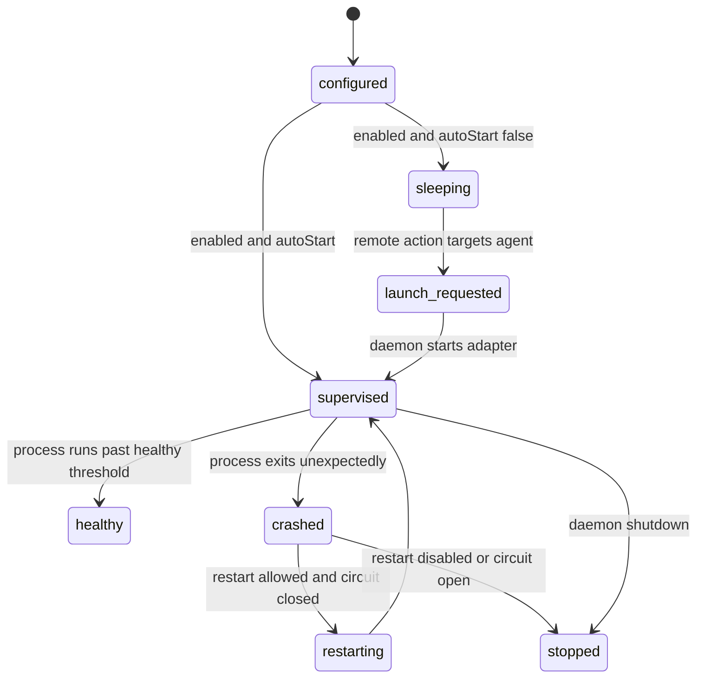
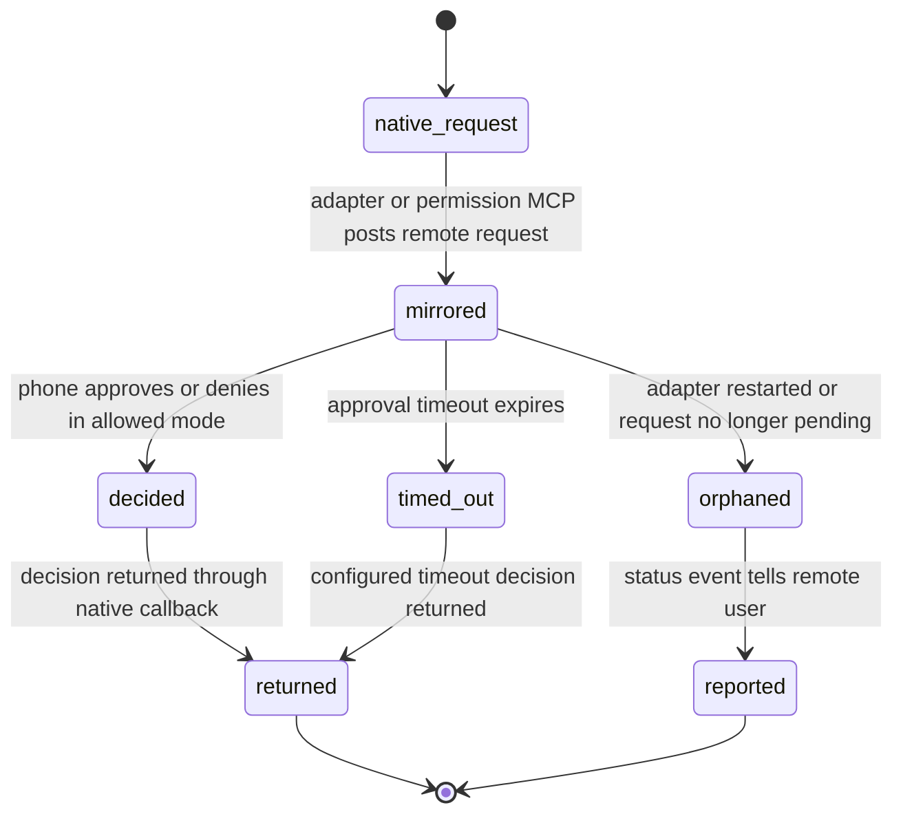
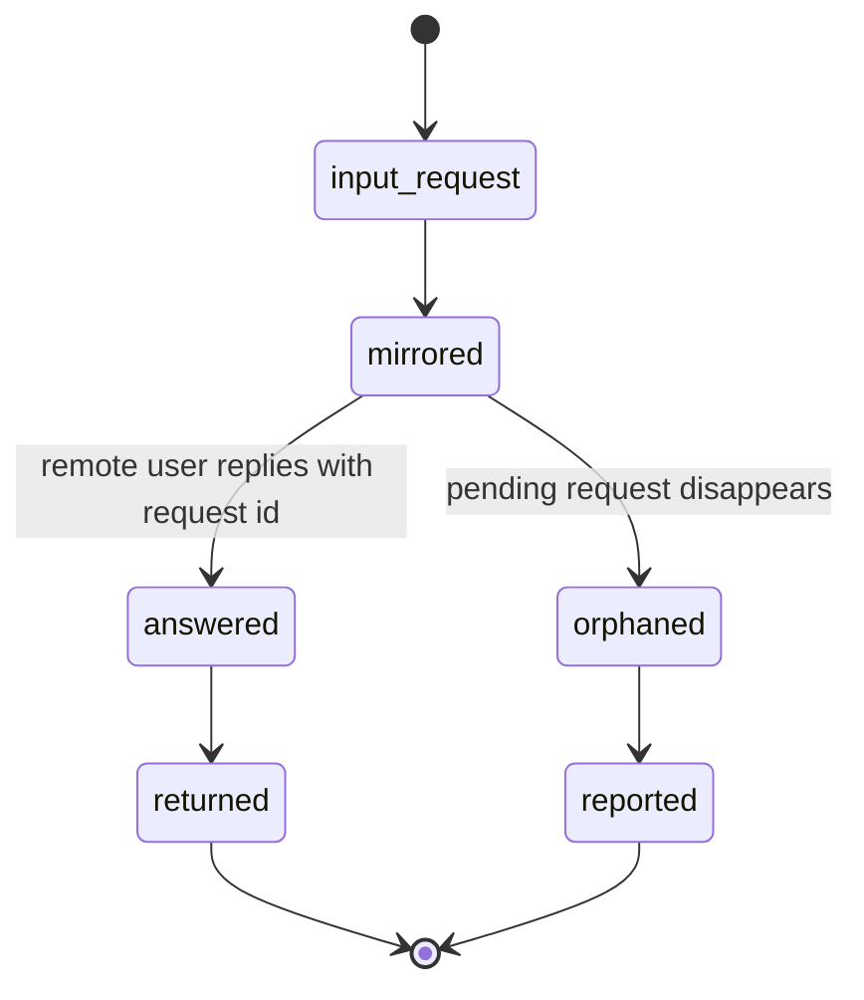
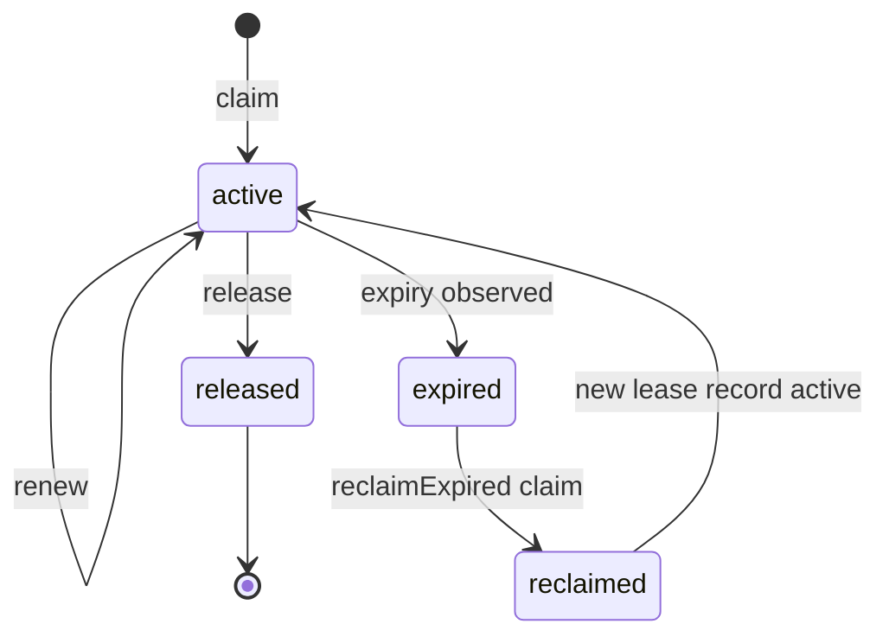
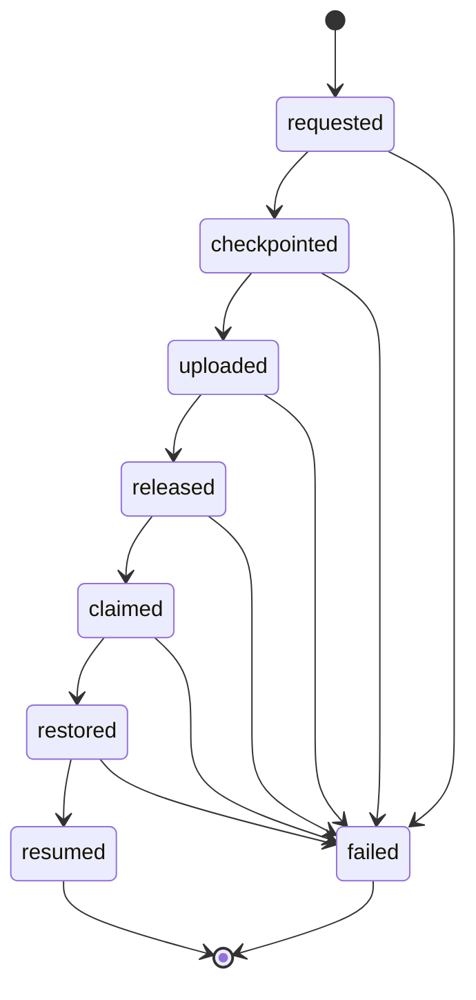
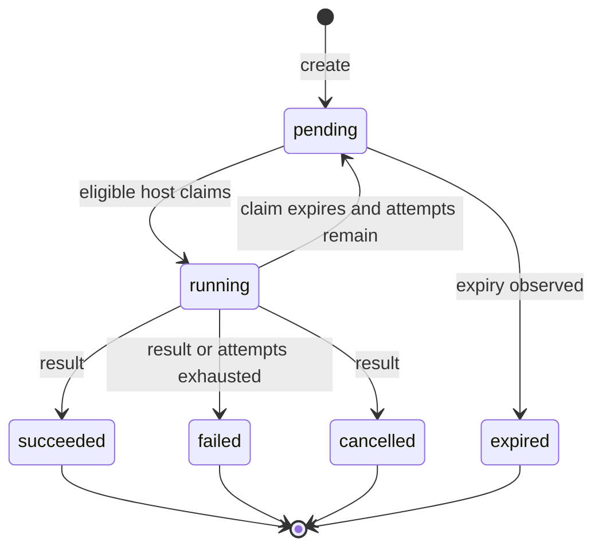
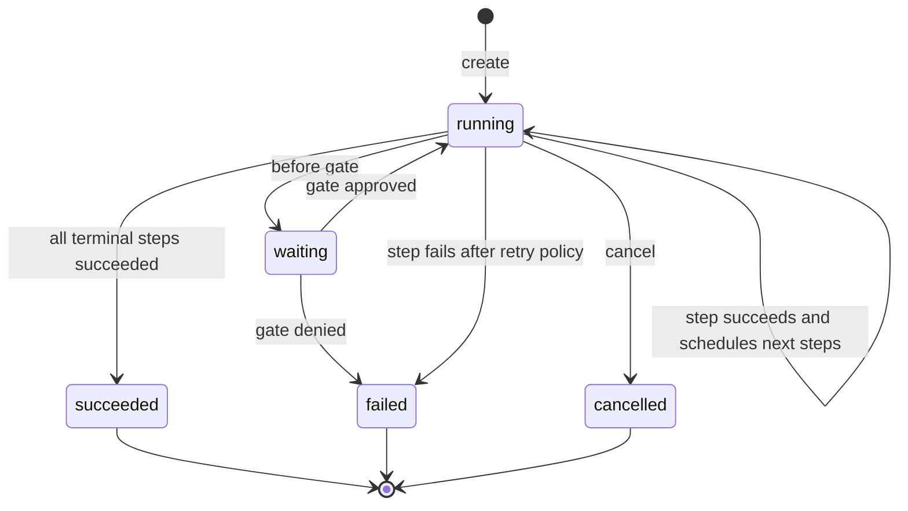
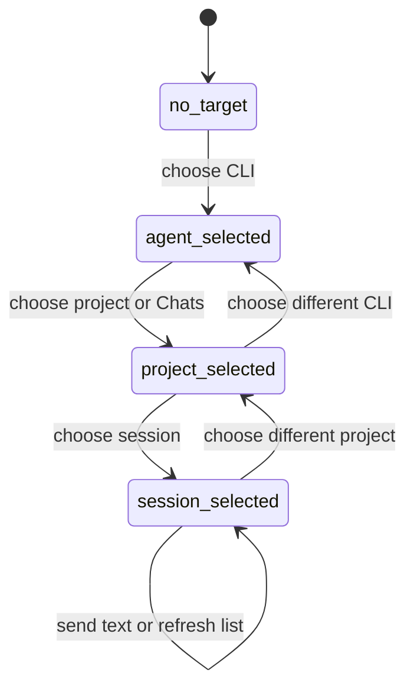

# State Machines

English | [Simplified Chinese](STATE_MACHINES.zh-CN.md)

## Agent Summary

This is the owner for state transitions: adapter runtime modes, daemon and adapter lifecycle, approvals, leases, handoffs, commands, workflows, and session selection. Read it before changing transition rules or terminal states. It complements storage and endpoint contracts but does not own their field-level schemas.

This document centralizes Legax state transitions that are otherwise spread across architecture, relay store, daemon, and adapter code.

## Adapter Runtime Modes

| Mode | Output forwarding | Phone text | Phone approvals | Exit condition |
| --- | --- | --- | --- | --- |
| `interactive` | Yes | Accepted | Accepted | Control message sets another mode. |
| `approval-only` | Yes | Ignored | Accepted | Control message sets another mode. |
| `monitor` | Yes | Ignored | Ignored | Control message sets another mode. |
| `paused` | Ignored | Ignored | Ignored | Only explicit `/mode <agentId> interactive` or equivalent clears it. |

Selecting an adapter may activate `interactive` only when the adapter is not already `paused`.

## Daemon And Adapter Lifecycle

The daemon owns supervision and on-demand launch. Adapters do not start siblings.

## Approval Lifecycle

Approvals are accepted only in `interactive` and `approval-only` modes. Timeout defaults must fail closed unless explicitly configured otherwise.

## User Input Lifecycle

Orphan responses are not silent drops; adapters must report status back to the remote surface.

## Portable Lease Lifecycle

Lease-protected writes require the current `hostId`, `fencingToken`, and `leaseToken`. Stale writers return `409`.

## Handoff Lifecycle

Transitions must occur in order. Retrying the same transition is idempotent; skipping forward is rejected.

## Relay Command Lifecycle

Result reporting requires the current `claimedBy` and `claimToken`. Replaying the same terminal result is idempotent; stale reports return `409`.

## Workflow Run Lifecycle

Workflow steps dispatch only known built-in command refs. Mutating steps require an active generation lease.

## Adapter Session Selection

Plain text should reach an adapter only after routing resolves a target agent. Session-specific adapters should persist the selected session through runtime state.
