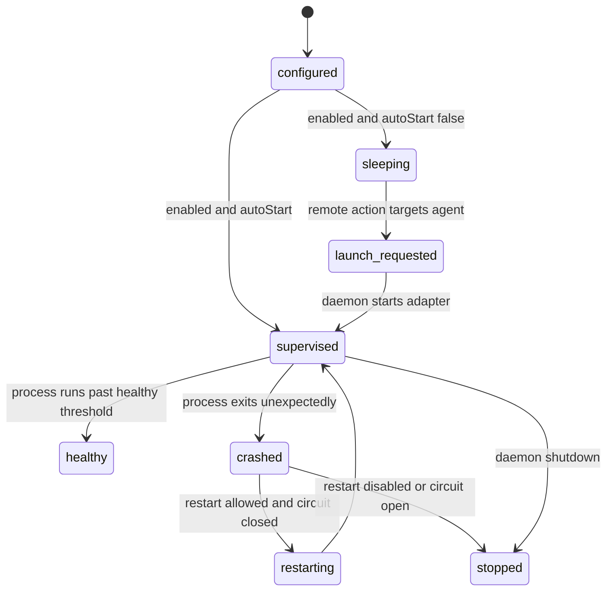
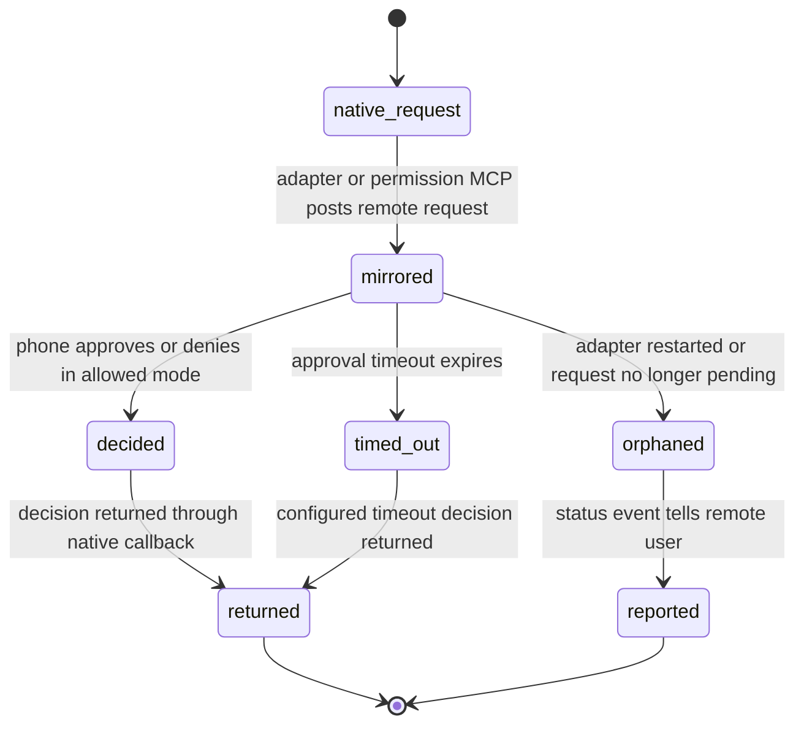
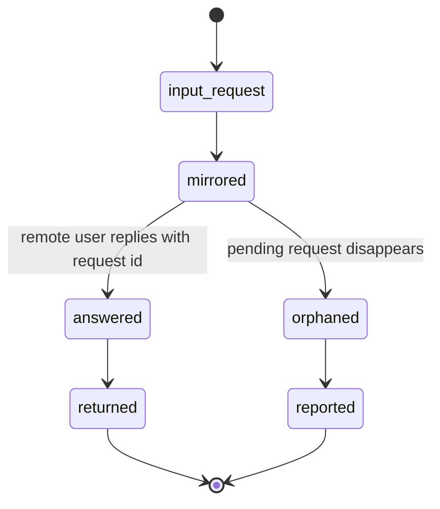
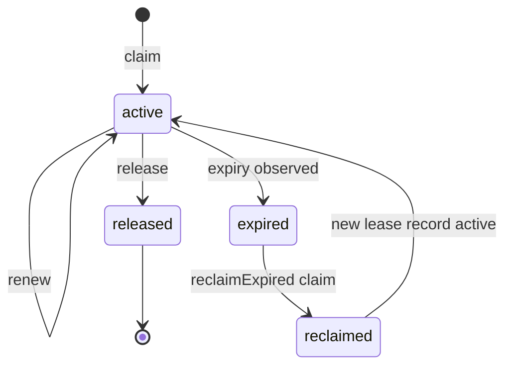
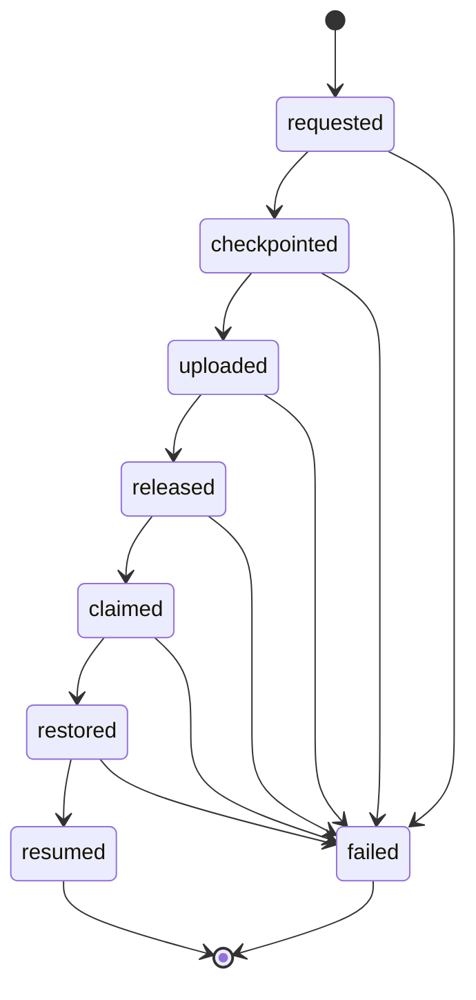
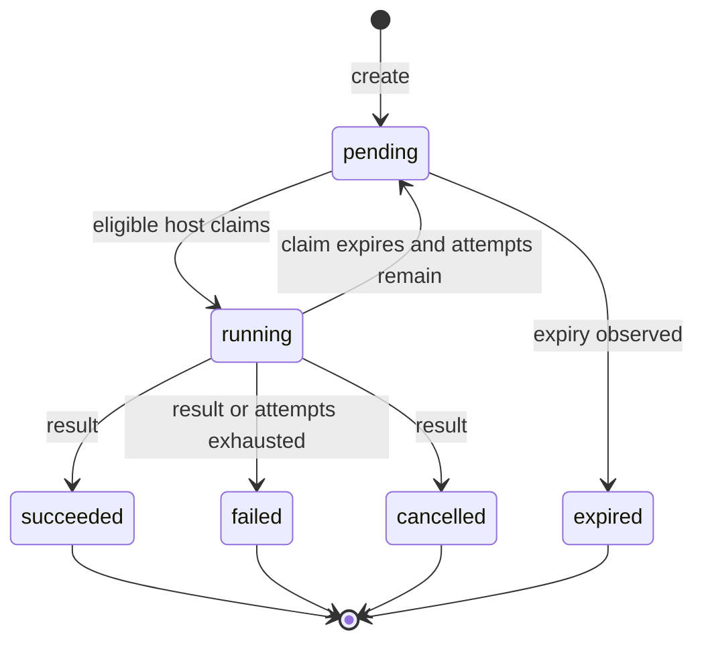
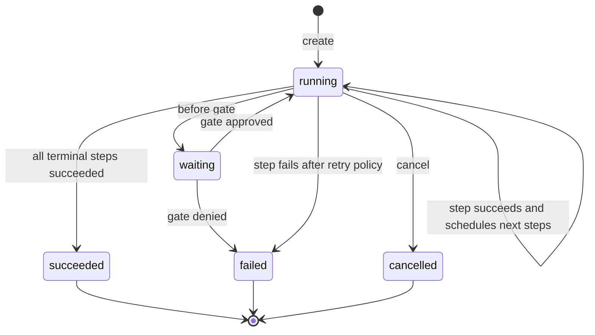
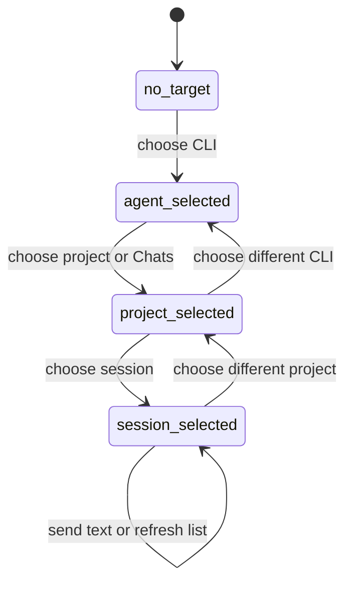

# 状态机

[English](STATE_MACHINES.md) | 简体中文

## Agent Summary

本文是状态转换的事实源，包括 adapter runtime mode、daemon 与 adapter lifecycle、approval、lease、handoff、command、workflow 和 session selection。修改 transition rule 或 terminal state 前先读本文。本文补充存储和 endpoint 契约，但不维护字段级 schema。

本文档集中记录 Legax 的状态转换；这些转换原本分散在架构、relay store、daemon 和 adapter 代码中。

## Adapter Runtime Mode

| Mode | 输出转发 | 手机文本 | 手机审批 | 退出条件 |
| --- | --- | --- | --- | --- |
| `interactive` | 是 | 接受 | 接受 | 控制消息设置其它 mode。 |
| `approval-only` | 是 | 忽略 | 接受 | 控制消息设置其它 mode。 |
| `monitor` | 是 | 忽略 | 忽略 | 控制消息设置其它 mode。 |
| `paused` | 忽略 | 忽略 | 忽略 | 只能通过显式 `/mode <agentId> interactive` 或等价动作清除。 |

选择 adapter 只有在 adapter 未处于 `paused` 时才可以激活 `interactive`。

## Daemon 与 Adapter 生命周期

Daemon 拥有监督和按需启动。Adapter 不启动兄弟 adapter。

## Approval 生命周期

审批只在 `interactive` 和 `approval-only` mode 下接受。除非明确配置，否则超时默认必须 fail closed。

## User Input 生命周期

孤儿响应不是静默丢弃；adapter 必须向远端 surface 回报 status。

## Portable Lease 生命周期

Lease-protected 写入需要当前 `hostId`、`fencingToken` 和 `leaseToken`。过期写入返回 `409`。

## Handoff 生命周期

Transition 必须按顺序发生。重复同一 transition 是幂等的；跳步会被拒绝。

## Relay Command 生命周期

Result 上报需要当前 `claimedBy` 和 `claimToken`。重复上报同一 terminal result 是幂等的；过期上报返回 `409`。

## Workflow Run 生命周期

Workflow step 只派发已知内置 command ref。会修改工作区的 step 需要 active generation lease。

## Adapter Session 选择

普通文本只有在路由解析出 target agent 后才应到达 adapter。需要 session 的 adapter 应通过 runtime state 持久化所选 session。
